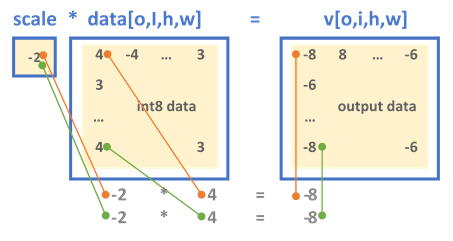
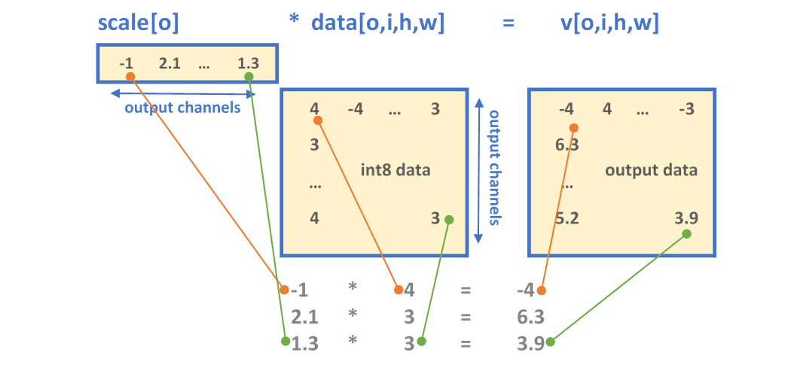

Int8 Inference {#dev_guide_inference_int8}
==========================================

## Introduction

To push higher performance during inference computations, recent work has
focused on computing at a lower precision (that is, shrinking the size of data
for activations and weights) to achieve higher throughput. Eight-bit
computations (referred to as int8) offer improved performance over
higher-precision types because they enable packing more data into a single
instruction, at the cost of reduced (but acceptable) accuracy.

## Int8 Workflow

There are different ways to use lower precision to perform inference. The
@ref dev_guide_attributes_quantization page describes what kind of
quantization model oneDNN supports.

### Quantization Process
To operate with int8 data types from a higher-precision format (for example,
32-bit floating point), data must first be _quantized_. The quantization
process converts a given input into a lower-precision format. The precision and
accuracy factors are determined by the scaling factors.

### Range of the Data
The data range is usually obtained by sampling the dataset of previous
executions in the original data type (for example, the activations and weights
from training in f32):

+ \f$ R = \max(abs(T))\f$.

Here \f$T\f$ is a tensor corresponding to either the weights or the
activations. Establishing the range of values used in the computation, and
selecting a proper scaling factor, prevents over- or underflows during
computation of the lower-precision results.

### Scaling Factor
The **quantization factor** is used to convert the
original values into the corresponding int8 range and is calculated as:

+ \f$ Q_{\alpha} = \frac{255}{R_{\alpha}}\f$ is the
quantization factor for activations with non-negative values.

+ \f$ Q_{w} = \frac{127}{R_{w}}\f$ is the quantization factor for weights.

The **quantized** activation, weights, and bias values are calculated as:

+ \f$\alpha_{u8} = \lceil Q_{\alpha} \alpha_{f32} \rceil \in [0,255]\f$,

+ \f$W_{s8} = \lceil Q_{w} W_{f32} \rceil \in [-127,127]\f$,

+ \f$b_{s32} = \lceil Q_{\alpha} Q_{w} b_{f32} \rceil \in [-2^{31},2^{31}-1]\f$.

Here \f$ \lceil \rceil \f$ denotes rounding according to the active rounding
mode (typically determined by the MXCSR register; the default value is
RoundNearestEven).

When the destination value is stored as a signed 32-bit integer, the result is
bound to the same quantization **scaling factors**:

+ \f$X_{s32} = W_{s8} \cdot \alpha{u8} + b_{s32} \approx Q_{\alpha} Q_{\omega} X_{f32}\f$,

+ where \f$X_{f32} = W_{f32} \cdot \alpha_{f32} + b_{f32}\f$.

Here the approximation is used to denote rounding.

The dequantized value is calculated as

+ \f$X_{f32} \approx \frac{1}{Q_{\alpha} Q_{\omega}} X_{s32} \f$.

### Quantization Example
To show how the quantization parameters are obtained, suppose we first start
with a set of high-precision input and output values. These values come from
sampling a previously executed training run and are stored as 32-bit floating
point values:

+ activations: \f$ T_{\alpha} = [15, 14, 15, \ldots, 8, 11 ]\f$
  where \f$ \max(abs(T_{\alpha})) = 15\f$

+ weights:\f$ T_{\omega} = [-5.1 , 6.8, \ldots, -1.2, 9.8 ]\f$
  where \f$ \max(abs(T_{\omega})) = 9.8\f$

+ bias:\f$ T_{\alpha} = [ 2.4, -5.2, \ldots, -8 ]\f$
  where \f$ \max(abs(T_{\alpha})) = 8\f$

The scaling factors are:

+ \f$ Q_{\alpha} = \frac{255}{R_{\alpha}} = \frac{255}{15} = 17 \f$

+ \f$ Q_{w} = \frac{127}{R_{w}} = \frac{127}{9.8} = 12.96\f$

Finally, the quantized input values for the int8 operation are calculated as:

+ \f$\alpha_{u8} = \lceil Q_{\alpha} \alpha_{f32} \rceil\f$
   \f$ = \Bigl \lceil 17 \cdot [15, 14, \ldots, 11 ] \Bigr \rceil = [255, 238, \ldots, 187] \f$

+ \f$W_{s8} = \lceil Q_{w} W_{f32} \rceil
    = \Bigl \lceil 12.96 \cdot [-5.1 , 6.8, \ldots, -1.2, 9.8 ] \Bigr \rceil
    = [-66, 88, \ldots, -15, 127] \f$

+ \f$b_{s32} = \lceil Q_{\alpha} Q_{w} b_{f32} \rceil
    = \Bigl \lceil 17 \cdot 12.96 \cdot [ 2.4, -5.2 \ldots, -8 ] \Bigr \rceil
    = [528, -1145, \ldots, -1762] \f$

These arrays are the new inputs for the int8 net.

## int8 Support

oneDNN supports int8 computations for inference by allowing one to specify that
primitives' input and output memory objects use int8 data types. int8
primitive implementations are optimized for high performance on the compatible
hardware (see @ref dev_guide_data_types).

### Attributes

Scaling factors can be configured using **primitive attributes**. It is also
possible to specify fused post-ops. All primitives support the attributes, but
not all combinations of parameters are supported. In the case of an unsupported
combination, the library returns an error.

In oneDNN, the scaling factor is applied to the output of a primitive.
Moreover, to perform input transformations (for example, source, bias, and
weights), oneDNN performs quantizing and dequantizing of data for int8 using
the **reorder primitive**.

oneDNN has two formats for defining the output scaling factor. Depending
on the configuration set by the scaling mask, either the output is scaled
uniformly across all the dimensions (_mask = 0_) or a set of scaling values is
applied to specific dimensions, as explained below:

* A *single floating point value* shared across the tensor

* An array of floating point values each corresponding to a specific output
  channel 

The **mask** parameter determines the dimension to which the scales array is
applied. The \f$i\f$-th bit of the mask selects the dimension
\f$D_i\f$ of an \f$n\f$-dimensional output tensor \f$T[D_0, \ldots,
D_{n-1}]\f$. For example:

+ The single-scale format always has mask = 0.

+ For a 5-dimensional tensor \f$T[G_0, O_1, I_2, H_3, W_4]\f$ where the
  indices correspond to the positions of bits in the mask:

  + A \f$mask = 2 = 2^1\f$ selects the output channel for scaling.

  + A \f$mask = 3 = 2^1 | 2^0\f$ selects the group and output channels.

Fused [post-ops](@ref dev_guide_attributes_post_ops) allow chaining
computations. Note that the resulting output value from post-ops is always
affected by the scaling factor.

## Example

@ref cnn_inference_int8_cpp example walks through the steps of int8 inference.
