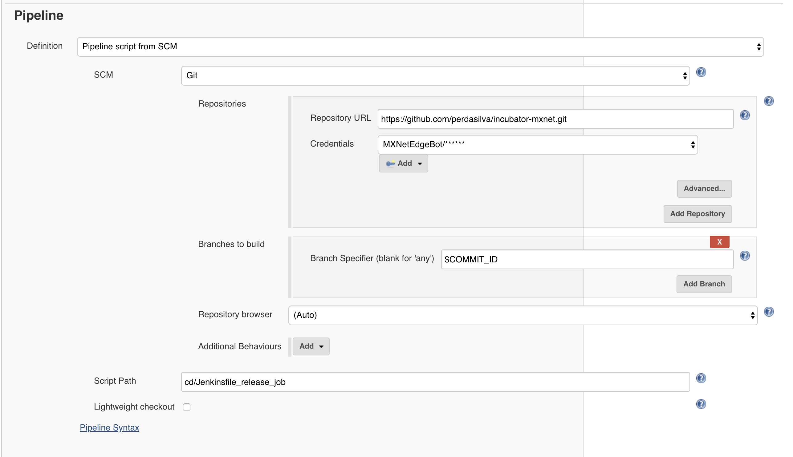

<!--
  ~ Licensed to the Apache Software Foundation (ASF) under one
  ~ or more contributor license agreements.  See the NOTICE file
  ~ distributed with this work for additional information
  ~ regarding copyright ownership.  The ASF licenses this file
  ~ to you under the Apache License, Version 2.0 (the
  ~ "License"); you may not use this file except in compliance
  ~ with the License.  You may obtain a copy of the License at
  ~
  ~   http://www.apache.org/licenses/LICENSE-2.0
  ~
  ~ Unless required by applicable law or agreed to in writing,
  ~ software distributed under the License is distributed on an
  ~ "AS IS" BASIS, WITHOUT WARRANTIES OR CONDITIONS OF ANY
  ~ KIND, either express or implied.  See the License for the
  ~ specific language governing permissions and limitations
  ~ under the License.
  ~
-->

# MXNet Continuous Delivery

## Introduction

MXNet aims to support a variety of frontends, e.g. Python, Java, Perl, R, etc. as well as environments (Windows, Linux, Mac, with or without GPU, with or without oneDNN support, etc.). This package contains a small continuous delivery (CD) framework used to automate the delivery nightly and release builds across our delivery channels.

<!-- TODO: Add links to the actual jobs, once this is live on PROD -->

The CD process is driven by the [CD pipeline job](Jenkinsfile_cd_pipeline), which orchestrates the order in which the artifacts are delivered. For instance, first publish the libmxnet library before publishing the pip package. It does this by triggering the [release job](Jenkinsfile_release_job) with a specific set of parameters for each delivery channel. The release job executes the specific release pipeline for a delivery channel across all MXNet *variants*.

A variant is a specific environment or features for which MXNet is compiled. For instance CPU, GPU with CUDA v10.1, CUDA v10.2 with oneDNN support, etc.

Currently, below variants are supported. All of these variants except native have oneDNN backend enabled.

* *cpu*: CPU
* *native*: CPU without oneDNN
* *cu101*: CUDA 10.1
* *cu102*: CUDA 10.2
* *cu110*: CUDA 11.0
* *cu112*: CUDA 11.2

*For more on variants, see [here](https://github.com/apache/mxnet/issues/8671)*

## Framework Components

### CD Pipeline Job

The [CD pipeline job](Jenkinsfile_cd_pipeline) take two parameters:

 * **RELEASE_BUILD**: Flags the run as a *release build*. The underlying jobs can then use this environment variable to disambiguate between nightly and release builds. Defaults to *false*.
 * **MXNET_VARIANTS**: A comma separated list of variants to build. Defaults to *all* variants.

This job defines and executes the CD pipeline. For example, first publish the MXNet library, then, in parallel, execute the python and maven releases. Every step of the pipeline executes a trigger for a [release job](Jenkinsfile_release_job).

### Release Job

The [release job](Jenkinsfile_release_job) takes five parameters:

 * **RELEASE_BUILD**: Flags the run as a *release build*. The underlying jobs can then use this environment variable to disambiguate between nightly and release builds. Defaults to *false*.
 * **MXNET_VARIANTS**: A comma separated list of variants to build. Defaults to *all* variants.
 * **RELEASE\_JOB\_NAME**: A name for this release job (Optional). Defaults to "Generic release job". It is used for debug output purposes.
 * **RELEASE\_JOB\_TYPE**: Defines the release pipeline you want to execute.
 * **COMMIT_ID**: The commit id to build

The release job executes, in parallel, the release pipeline for each of the variants (**MXNET_VARIANTS**) for the job type (**RELEASE\_JOB\_TYPE**). The job type the path to a directory (relative to the `cd` directory) that includes a `Jenkins_pipeline.groovy` file ([e.g.](mxnet_lib/Jenkins_pipeline.groovy)).

NOTE: The **COMMIT_ID** is a little tricky and we must be very careful with it. It is necessary to ensure that the same commit is built through out the pipeline, but at the same time, it has the potential to change the current state of the release job configuration - specifically the parameter configuration. Any changes to this configuration will require a "dry-run" of the release job to ensure Jenkins has the current (master) version. This is acceptable as there will be few changes to the parameter configuration for the job, if any at all. But, it's something to keep in mind.

To avoid potential issues as much as possible, the CD pipeline executes this "dry run" and ensures that Jenkins' state of the release job matches what is defined for the release job in the specified COMMIT_ID. This is done by setting the **RELEASE_JOB_TYPE** to *Status Update*.

It should be noted that the 'Pipeline' section of the configuration should use the *$COMMIT_ID* parameter as the specifier and 'lightweight checkout' unchecked. For example:



### Release Pipelines: Jenkins_pipeline.groovy

This file defines the release pipeline for a particular release channel. It defines a function `get_pipeline(mxnet_variant)`, which returns a closure with the pipeline to be executed. For instance:

```
def get_pipeline(mxnet_variant) {
  return {
    stage("${mxnet_variant}") {
      stage("Build") {
        timeout(time: max_time, unit: 'MINUTES') {
          build(mxnet_variant)
        }
      }
      stage("Test") {
        timeout(time: max_time, unit: 'MINUTES') {
          test(mxnet_variant)
        }
      }
      stage("Publish") {
        timeout(time: max_time, unit: 'MINUTES') {
          publish(mxnet_variant)
        }
      }
    }
  }
}

def build(mxnet_variant) {
  node(UBUNTU_CPU) {
    ...
  }
}
...
```

## Binary Releases

The "first mile" of the CD process is posting the mxnet binaries to the [artifact repository](utils/artifact_repository.md). Once this step is complete, the pipelines for the different release channels (PyPI, Maven, etc.) can begin from the compiled binary, and focus solely on packaging it, testing the package, and posting it to the particular distribution channel.

<!-- TODO: Once all the artifact repository Jenkins utility functions are in, list them here -->

## Adding New Release Pipelines

1. Create a directory under `cd` which represents your release channel, e.g. `python/pypi`.
2. Add a `Jenkins_pipeline.groovy` there with a `get_pipeline(mxnet_variant)` function that describes your pipeline.
3. Add a call to your pipeline to the [CD pipeline job](Jenkinsfile_cd_pipeline).

#### General Guidelines:

##### Timeout

We shouldn't set global timeouts for the pipelines. Rather, the `step` being executed should be rapped with a `timeout` function (as in the pipeline example above). The `max_time` is a global variable set at the [release job](Jenkinsfile_release_job) level.

##### Node of execution

Ensure that either your steps, or the whole pipeline are wrapped in a `node` call. The jobs execute in an `utility` node. If you don't wrap your pipeline, or its individual steps, in a `node` call, this will lead to problems.

Examples of the two approaches:

<!-- TODO: Add links to examples once the all pipelines are in -->

**Whole pipeline**

The release pipeline is executed on a single node, depending on the variant building released.
This approach is fine, as long as the stages that don't need specialized hardware (e.g. compilation, packaging, publishing), are short lived.

```
def get_pipeline(mxnet_variant) {
  def node_type = mxnet_variant.startsWith('cu') ? NODE_LINUX_GPU : NODE_LINUX_CPU

  return {
    node (node_type) {
      stage("${mxnet_variant}") {
        stage("Build") {
          ...
        }
        stage("Test") {
          ...
        }
        ...
      }
    }
  }
}
```

Examples:

 * [PyPI Release](python/pypi/Jenkins_pipeline.groovy): In this pipeline, the majority of time is overwhelmingly spent on testing. Therefore, it should be ok to execute the whole pipeline on a GPU node (i.e. packaging, testing, and publishing).

**Per step**

Use this approach in cases where you have long running stages that don't depend on specialized/expensive hardware.

```
def get_pipeline(mxnet_variant) {
  return {
    stage("${mxnet_variant}") {
      stage("Build") {
        ...
      }
      ...
    }
  }
}

def build(mxnet_variant) {
  node(UBUNTU_CPU) {
    ...
  }
}

def test(mxnet_variant) {
  def node_type = mxnet_variant.startsWith('cu') ? NODE_LINUX_GPU : NODE_LINUX_CPU
  node(node_type) {
    ...
  }
}
```

Examples:

The [libmxnet](mxnet_lib/Jenkins_pipeline.groovy) pipeline has long running compilation and testing stages that **do not** require specialized/expensive hardware (e.g. GPUs). Therefore, as much as possible, it is important to run each stage in on its own node, and design the pipeline to spend the least amount of time possible on expensive hardware. E.g. for GPU builds, only run GPU tests on GPU instances, all other stages can be executed on CPU nodes.
