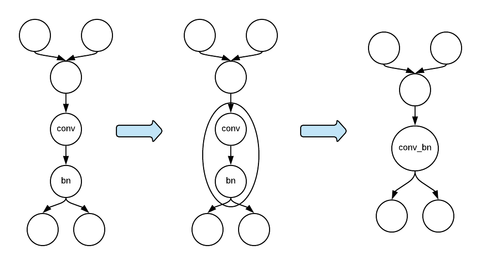

## How to Integrate Backend Libraries to MXNet with the Subgraph API

The subgraph API has been proposed and implemented as the default mechanism for integrating backend libraries to MXNet. The subgraph API is a very flexible interface. Although it was proposed as an integration mechanism, it has been used as a tool for manipulating NNVM graphs for graph-level optimizations, such as operator fusion.

The subgraph API works as the following steps:

* Search for particular patterns in a graph.
* Group the operators/nodes with particular patterns into a subgraph and shrink the subgraph into a single node.
* Put the subgraph node back to the original graph to replace the subgraph.

The figure below illustrates the subgraph mechanism.



The subgraph API allows the backend developers to customize the subgraph mechanism in two places:

* Subgraph searching: define a subgraph selector to search for particular patterns in a computation graph.
* Subgraph node creation: attach an operator to run the computation in the subgraph. We can potentially manipulate the subgraph here.


Below I will illustrate the subgraph API with a very simple task, as shown in the figure above. That is, replacing convolution and batch_norm with the conv_bn.

The first step is to define a subgraph selector to find the required pattern. To find a pattern that has convolution and batch_norm, we can start the search on the node with convolution. Then from the convolution node, we search for batch_norm along the outgoing edge.

```C++
class SgSelector : public SubgraphSelector {
 public:
  SgSelector() {
    find_bn = false;
  }
  bool Select(const nnvm::Node &n) override {
    // Here we start on the convolution node to search for a subgraph.
    return n.op() && n.op()->name == "Convolution";
  }
  bool SelectInput(const nnvm::Node &n, const nnvm::Node &new_node) override {
    // We don't need to search on the incoming edge.
    return false;
  }
  bool SelectOutput(const nnvm::Node &n, const nnvm::Node &new_node) override {
    // We search on the outgoing edge. Once we find a batch_norm node, we won't
    // accept any more batch_norm nodes.
    if (new_node.op() && new_node.op()->name == "BatchNorm" && !find_bn) {
      find_bn = true;
      return true;
    } else {
      return false;
    }
  }
  std::vector<nnvm::Node *> Filter(const std::vector<nnvm::Node *> &candidates) override {
    // We might have found a convolution node, but we might have failed to find a batch_norm
    // node that uses the output of the convolution node. If we failed, we should skip
    // the convolution node as well.
    if (find_bn)
      return candidates;
    else
      return std::vector<nnvm::Node *>();
  }
 private:
  bool find_bn;
};
```

The second step is to define a subgraph property to use the subgraph selector above to customize the subgraph searching. By defining this class, we can also customize subgraph node creation. When customizing node creation, we can specify what operator to run the subgraph on the node. In this example, we use CachedOp, which itself is a graph executor, to run the subgraph with convolution and batch_norm. In practice, it's most likely that we use a single operator from a backend library to replace the two operators for execution.

```C++
class SgProperty : public SubgraphProperty {
 public:
  static SubgraphPropertyPtr Create() {
    return std::make_shared<SgProperty>();
  }
  nnvm::NodePtr CreateSubgraphNode(
      const nnvm::Symbol &sym, const int subgraph_id = 0) const override {
    // We can use CachedOp to execute the subgraph.
    nnvm::NodePtr n = nnvm::Node::Create();
    n->attrs.op = Op::Get("_CachedOp");
    n->attrs.name = "ConvBN" + std::to_string(subgraph_id);
    n->attrs.subgraphs.push_back(std::make_shared<nnvm::Symbol>(sym));
    std::vector<std::pair<std::string, std::string> > flags{{"static_alloc", "true"}};
    n->attrs.parsed = CachedOpPtr(new CachedOp(sym, flags));
    return n;
  }
  SubgraphSelectorPtr CreateSubgraphSelector() const override {
    return std::make_shared<SgSelector>();
  }
};
```

After defining the subgraph property, we need to register it.

```C++
MXNET_REGISTER_SUBGRAPH_PROPERTY(SgTest, SgProperty);
```

After compiling this subgraph mechanism into MXNet, we can use the environment variable `MXNET_SUBGRAPH_BACKEND` to activate it.

```bash
export MXNET_SUBGRAPH_BACKEND=SgTest
```

