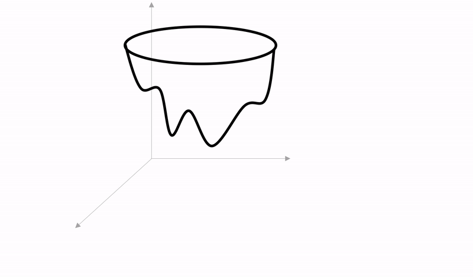
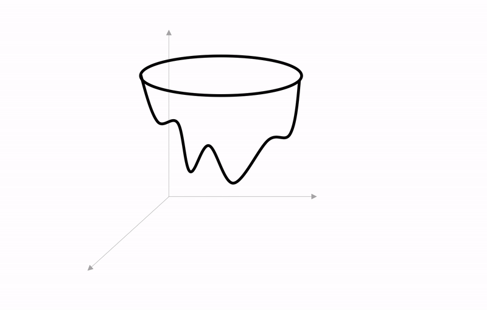
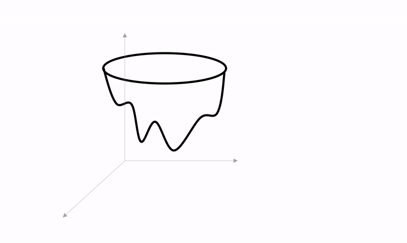

<!--- Licensed to the Apache Software Foundation (ASF) under one -->
<!--- or more contributor license agreements.  See the NOTICE file -->
<!--- distributed with this work for additional information -->
<!--- regarding copyright ownership.  The ASF licenses this file -->
<!--- to you under the Apache License, Version 2.0 (the -->
<!--- "License"); you may not use this file except in compliance -->
<!--- with the License.  You may obtain a copy of the License at -->

<!---   http://www.apache.org/licenses/LICENSE-2.0 -->

<!--- Unless required by applicable law or agreed to in writing, -->
<!--- software distributed under the License is distributed on an -->
<!--- "AS IS" BASIS, WITHOUT WARRANTIES OR CONDITIONS OF ANY -->
<!--- KIND, either express or implied.  See the License for the -->
<!--- specific language governing permissions and limitations -->
<!--- under the License. -->

# Optimizers

Deep learning models are comprised of a model architecture and the model parameters. The model architecture is chosen based on the task - for example Convolutional Neural Networks (CNNs) are very successful in handling image based tasks and Recurrent Neural Networks (RNNs) are better suited for sequential prediction tasks. However, the values of the model parameters are learned by solving an optimization problem during model training.

To learn the parameters, we start with an initialization scheme and iteratively refine the parameter initial values by moving them along a direction that is opposite to the (approximate) gradient of the loss function. The extent to which the parameters are updated in this direction is governed by a hyperparameter called the learning rate. This process, known as gradient descent, is the backbone of optimization algorithms in deep learning. In MXNet, this functionality is abstracted by the [Optimizer API](/api/python/docs/api/optimizer/index.html#module-mxnet.optimizer).

When training a deep learning model using the MXNet [gluon API](/api/python/docs/tutorials/packages/gluon/index.html), a gluon [Trainer](/api/python/docs/tutorials/packages/gluon/training/trainer.html) is initialized with the all the learnable parameters and the optimizer to be used to learn those parameters. A single step of iterative refinement of model parameters in MXNet is achieved by calling [trainer.step](/api/python/docs/api/gluon/trainer.html#mxnet.gluon.Trainer.step) which in turn uses the gradient (and perhaps some state information) to update the parameters by calling `optimizer.update`.

Here is an example of how a trainer with an optimizer is created for, a simple Linear (Dense) Network.


```python
from mxnet import gluon, optimizer

net = gluon.nn.Dense(1)
net.initialize()
optim = optimizer.SGD(learning_rate=0.1)
trainer = gluon.Trainer(net.collect_params(), optimizer=optim)
```

In model training, the code snippet above would be followed by a training loop which, at every iteration performs a forward pass (to compute the loss), a backward pass (to compute the gradient of the loss with respect to the parameters) and a trainer step (which updates the parameters using the gradient). See the [gluon Trainer guide](/api/python/docs/tutorials/packages/gluon/training/trainer.html) for a complete example.

We can also create the trainer by passing in the optimizer name and optimizer params into the trainer constructor directly, as shown below.


```python
trainer = gluon.Trainer(net.collect_params(), optimizer='adam', optimizer_params={'learning_rate':1})
```

### What should I use?
For many deep learning model architectures, the `sgd` and `adam` optimizers are a really good place to start. If you are implementing a deep learning model and trying to pick an optimizer, start with [sgd](/api/python/docs/api/optimizer/index.html#mxnet.optimizer.SGD) as you will often get good enough results as long as your learning problem is tractable. If you already have a trainable model and you want to improve the convergence then you can try [adam](/api/python/docs/api/optimizer/index.html#mxnet.optimizer.Adam). If you would like to improve your model training process further, there are a number of specialized optimizers out there with many of them already implemented in MXNet. This guide walks through these optimizers in some detail.

## Stochastic Gradient Descent
[Gradient descent](https://en.wikipedia.org/wiki/Gradient_descent) is a general purpose algorithm for minimizing a function using information from the gradient of the function with respect to its parameters. In deep learning, the function we are interested in minimizing is the [loss function](/api/python/docs/tutorials/packages/gluon/loss/loss.html). Our model accepts training data as inputs and the loss function tells us how good our model predictions are. Since the training data can routinely consist of millions of examples, computing the loss gradient on the full batch of training data is very computationally expensive. Luckily, we can effectively approximate the full gradient with the gradient of the loss function on randomly chosen minibatches of our training data. This variant of gradient descent is [stochastic gradient descent](https://en.wikipedia.org/wiki/Stochastic_gradient_descent).

Technically, stochastic gradient descent (SGD) refers to an online approximation of the gradient descent algorithm that computes the gradient of the loss function applied to a *single datapoint*, instead of your entire dataset, and uses this approximate gradient to update the model parameter values. However, in MXNet, and other deep learning frameworks, the SGD optimizer is agnostic to how many datapoints the loss function is applied to, and it is more effective to use a mini-batch loss gradient, as described earlier, instead of a single datapoint loss gradient.

### [SGD optimizer](/api/python/docs/api/optimizer/index.html#mxnet.optimizer.SGD)

For an SGD optimizer initialized with learning rate $lr$, the update function accepts parameters (weights) $w_i$, and their gradients $grad(w_i)$, and performs the single update step:

$$w_{i+1} = w_i + lr\cdot -grad(w_i)$$

visualized in the diagram shown below.

<p align="center">
    
</p>


### Weight decay
The SGD update step can be modified by introducing an extra term that enforces a penalty on the size of the parameters. This is achieved by subtracting a fraction of the weight $\delta\cdot w$ during the weight update as shown below.

$$w_{i+1} = w_i + lr\cdot (-grad(w_i) -\delta\cdot w_i)$$

Introducing weight decay modifies the objective of the optimization problem by adding an implicit regularization term to penalizes large weights. Weight decay is discussed more extensively in this [paper](https://papers.nips.cc/paper/563-a-simple-weight-decay-can-improve-generalization.pdf).

### Momentum
The convergence of the  SGD optimizer can be accelerated by incorporating momentum. Originally proposed by [Polyak (1964)](https://www.sciencedirect.com/science/article/abs/pii/0041555364901375), SGD with momentum improves the approximation of the gradient term by incorporating the gradients from previous update steps. To achieve this, SGD with momentum stores and 'remembers' the update at each iteration to be included in the next iteration. In the equations below we denote the momentum history as $v$.

For the first update the SGD optimizer with momentum performs the single update step:

$$ v_1= lr\cdot -grad(w_0)$$
$$ w_1= w_0 + v_1 $$

For subsequent updates, SGD with momentum, with momentum parameter $\gamma$, performs the update step:

$$ v_{i+1} = \gamma \cdot v_{i} + lr\cdot -grad(w_{i}) $$
$$ w_{i+1} = w_i + v_{i+1} $$

This is also shown in the diagram below.

<p align="center">
    
</p>


The use of SGD with momentum for learning in neural networks was introduced by Rumelhart, Hinton and Williams in [Learning Internal Representations by Error Propagation](https://dl.acm.org/citation.cfm?id=104279.104293).

To create an SGD optimizer with momentum $\gamma$ and weight decay in MXNet simply use the following code.


```python
sgd_optimizer = optimizer.SGD(learning_rate=0.1, wd=0., momentum=0.8)
```

### [Nesterov Accelerated Stochastic Gradient Descent](/api/python/docs/api/optimizer/index.html#mxnet.optimizer.NAG)

The momentum method of [Nesterov] is a modification to SGD with momentum that allows for even faster convergence in practice. With Nesterov accelerated gradient (NAG) descent, the update term is derived from the gradient of the loss function with respect to *refined parameter values*. These refined parameter values are computed by performing a SGD update step using the momentum history as the gradient term.

Alternatively, you can think of the NAG optimizer as performing two update steps:
* The first (internal) update step approximates uses the current momentum history $v_i$ to calculate the refined parameter values $(w_i + \gamma \cdot v_i)$. This is also known as the lookahead step.
* The second (actual) step uses the gradient of the loss function with respect to the lookahead parameter values from the first step and the current momentum history $v_i$ to obtain a new direction to update our original parameter values, like classical momentum.

The NAG optimizer with momentum parameter $\gamma$ performs the update step:

$$ v_{i+1} = \gamma \cdot v_{i} + lr\cdot -grad(w_{i} + \gamma \cdot v_i) $$
$$ w_{i+1} = w_i + v_{i+1} $$

<p align="center">
    
</p>


The effects of using NAG over SGD and classical momentum are discussed in this [paper](http://proceedings.mlr.press/v28/sutskever13.pdf) by Sutskever et al.

The NAG optimizer can be initialized in MXNet by using the code snippet below or by creating a trainer with argument `optimizer='nag'`.


```python
nag_optimizer = optimizer.NAG(learning_rate=0.1, momentum=0.8)
```

## Adaptive Learning Rate Methods

The gradient methods implemented by the optimizers described above use a global learning rate hyperparameter for all parameter updates. This has a well-documented shortcoming in that it makes the training process and convergence of the optimization algorithm really sensitive to the choice of the global learning rate. Adaptive learning rate methods avoid this pitfall by incorporating some history of the gradients observed in earlier iterations to scale step sizes (learning rates) to each learnable parameter in the model.

### [AdaGrad](/api/python/docs/api/optimizer/index.html#mxnet.optimizer.AdaGrad)

The AdaGrad optimizer, which implements the optimization method originally described by [Duchi et al](http://www.jmlr.org/papers/volume12/duchi11a/duchi11a.pdf), multiplies the global learning rate by the $L_2$ norm of the preceeding gradient estimates for each paramater to obtain the per-parameter learning rate. To achieve this, AdaGrad introduces a new term which we'll denote as $g^2$ - the accumulated square of the gradient of the loss function with respect to the parameters.

Thus the AdaGrad optimizer update function performs the update steps below to obtain $i+1$th refinement.

$$ g^2_{i+1} = g^2_{i} + grad(w_i)^2 $$
$$ w_{i+1} = w_i + \dfrac{lr}{\sqrt{g^2 + \epsilon}}\cdot -grad(w_i)$$

The $\epsilon$ term is a tiny positive value introduced to avoid division by zero due to floating point issues.

The overaching benefit of AdaGrad over SGD is that it ensures the overall convergence is more resilient to the choice of the global learning rate $lr$ especially in tasks, such as natural language processing some data is sparse but the parameters influenced by the sparse data are quite informative.

To instantiate the Adagrad optimizer in MXNet you can use the following line of code.


```python
adagrad_optimizer = optimizer.AdaGrad(learning_rate=0.1, eps=1e-07)
```

### [RMSProp](/api/python/docs/api/optimizer/index.html#mxnet.optimizer.RMSProp)

RMSProp, introduced by [Tielemen and Hinton](http://www.cs.toronto.edu/~tijmen/csc321/slides/lecture_slides_lec6.pdf), is similar to AdaGrad described above, but, instead of accumulating the sum of historical square gradients, maintains an exponential decaying average of the historical square gradients, in order to give more weighting to more recent gradients.

For rmsprop, we introduce the term $\mathbb{E}[g^2]$ - the decaying average over past squared gradients and $\beta$ as the forgetting factor. The rmsprop optimizer performs the update given below.


$$ \mathbb{E}[g^2]_{i+1} = \beta\cdot\mathbb{E}[g^2]_{i} + (1-\beta)\cdot [grad(w_{i})]^2 $$
$$ w_{i+1} = w_i + \dfrac{lr}{\sqrt{\mathbb{E}[g^2]_{i+1} + \epsilon}}\cdot -grad(w_i) $$

The $\epsilon$ term is included, as in AdaGrad, for numerical stability.

RMSProp was derived independently of AdaGrad and the name RMSProp derives from a combination of [RProp](https://en.wikipedia.org/wiki/Rprop) and the RMS, root mean square, operation in the denominator of the weight update.


#### RMSProp (Centered)
The MXNet RMSProp optimizer with the `centered=True` argument implements a variant of the RMSProp update described by [Alex Graves](https://arxiv.org/pdf/1308.0850v5.pdf), which centres the second moment $\mathbb{E}[g^2]$ or decaying average of square gradients by subtracting the square of decaying average of gradients. It also adds an explicit momentum term to weight past update steps. Representing the decaying average of gradients as $\mathbb{E}[g]$ and momentum parameter as $\gamma$, we add another equation to the non-centered rmsprop update described above.

The centered RMSProp optimizer performs the update step:

$$ \mathbb{E}[g]_{i+1} = \beta\cdot\mathbb{E}[g]_{i} + (1-\beta)\cdot [grad(w_{i})] $$
$$ \mathbb{E}[g^2]_{i+1} = \beta\cdot\mathbb{E}[g^2]_{i} + (1-\beta)\cdot [grad(w_{i})]^2 $$
$$ v_{i+1} = \gamma \cdot v_{i} + \dfrac{lr}{\sqrt{\mathbb{E}[g^2]_{i+1} - \mathbb{E}[g]^2_{i+1}+ \epsilon}}\cdot -grad(w_{i}) $$
$$ w_{i+1} = w_i + v_{i+1} $$

Here is an example snippet creating the RMSProp optimizer in MXNet.


```python
rmsprop_optimizer = optimizer.RMSProp(learning_rate=0.001, gamma1=0.9, gamma2=0.9, epsilon=1e-07, centered=False)
```

In the code snippet above, `gamma1` is $\beta$ in the equations above and `gamma2` is $\gamma$, which is only used where `centered=True`.

### [AdaDelta](/api/python/docs/api/optimizer/index.html#mxnet.optimizer.AdaDelta)

AdaDelta was introduced to address some remaining lingering issues with AdaGrad and RMSProp - the selection of a global learning rate. AdaGrad and RMSProp assign each parameter its own learning rate but the per-parameter learning rate are still calculated using the global learning rate. In contrast, AdaDelta does not require a global learning rate, instead, it tracks the square of previous update steps, represented below as $\mathbb{E}[\Delta w^2]$ and uses the root mean square of the previous update steps as an estimate of the learning rate.

The AdaDelta optimizer performs the following equations in its update step:

$$ \mathbb{E}[\Delta w^2]_{i+1} = \beta\cdot\mathbb{E}[\Delta w^2]_i + (1 - \beta) \cdot (w_i - w_{i-1})^2 $$
$$ \mathbb{E}[g^2]_{i+1} = \beta\cdot\mathbb{E}[g^2]_{i} + (1-\beta)\cdot [grad(w_{i})]^2 $$
$$ w_{i+1} = w_i + \dfrac{\sqrt{\mathbb{E}[\Delta w^2] + \epsilon}}{\sqrt{\mathbb{E}[g^2]_{i+1} + \epsilon}} \cdot -grad(w_i)$$

As evident from the above equations, AdaDelta is similar to RMSProp but does not require you to specify $lr$ and instead uses $\sqrt{\mathbb{E}[\Delta w^2] + \epsilon}$ as the estimated learning rate. AdaDelta was introduced by Zeiler in this [paper](https://arxiv.org/abs/1212.5701).

Here is the code snippet creating the AdaDelta optimizer in MXNet. The argument `rho` in the code is $\beta$ in the update equations. Notice there is no learning rate argument in the code.


```python
adadelta_optimizer = optimizer.AdaDelta(rho=0.9, epsilon=1e-07)
```

### [Adam](/api/python/docs/api/optimizer/index.html#mxnet.optimizer.Adam)
Adam, introduced by [Kingma and Ba](https://arxiv.org/abs/1412.6980), is one of the popular adaptive algorithms for deep learning. It combines elements of RMSProp with momentum SGD. Like RMSProp, Adam uses the RootMeanSquare of decaying average of historical gradients but also explicitly keeps track of a decaying average of momentum and uses that for the update step direction. Thus, Adam accepts two hyperparameters $\beta_1$ and $\beta_2$ for momentum weighting and gradient RMS weighting respectively. Adam also accepts a global learning rate that's adaptively tuned to each parameter with the gradient RootMeanSquare. Finally, Adam also includes bias correction steps within the update that transform the biased estimates of first and second order moments, $v_{i+1}$ and $\mathbb{E}[g^2]_{i+1}$ to their unbiased counterparts $\tilde{v}_{i+1}$ and $\tilde{\mathbb{E}[g^2]}_{i+1}$

The Adam optimizer performs the update step described the following equations:

$$ v_{i+1} = \beta_1 \cdot v_{i} + (1 - \beta_1) \cdot grad(w_i) $$
$$ \mathbb{E}[g^2]_{i+1} = \beta_2\cdot\mathbb{E}[g^2]_{i} + (1-\beta_2)\cdot [grad(w_{i})]^2 $$
$$ \tilde{v}_{i+1} = \dfrac{v_{i+1}}{1 - (\beta_1)^{i+1}} $$
$$ \tilde{\mathbb{E}[g^2]}_{i+1} = \dfrac{\mathbb{E}[g^2]_{i+1}}{1 - (\beta_2)^{i+1}} $$
$$ w_{i+1} = w_i + \dfrac{lr}{\sqrt{\tilde{\mathbb{E}[g^2]}_{i+1}} + \epsilon} \cdot -\tilde{v}_{i+1} $$

In MXNet, you can construct the Adam optimizer with the following line of code.


```python
adam_optimizer = optimizer.Adam(learning_rate=0.001, beta1=0.9, beta2=0.999, epsilon=1e-08)
```

### [Adamax](/api/python/docs/api/optimizer/index.html#mxnet.optimizer.Adamax)
Adamax is a variant of Adam also included in the original paper by [Kingma and Ba](https://arxiv.org/abs/1412.6980). Like Adam, Adamax maintains a moving average for first and second moments but Adamax uses the $L_{\infty}$ norm for the exponentially weighted average of the gradients, instead of the $L_2$ norm used in Adam used to keep track of the gradient second moment. The $L_{\infty}$ norm of a vector is equivalent to take the maximum absolute value of elements in that vector.

$$ v_{i+1} = \beta_1 \cdot v_{i} + (1 - \beta_1) \cdot grad(w_i) $$
$$ g^\infty_{i+1} = \mathtt{max}(\beta_2\cdot g^\infty_{i},  |{grad(w_i)}|) $$
$$ \tilde{v}_{i+1} = \dfrac{v_{i+1}}{1 - \beta_1^{i+1}} $$
$$ w_{i+1} = w_i + \dfrac{lr}{g^\infty_{i+1} + \epsilon} \cdot - \tilde{v}_{i+1} $$

See the code snippet below for how to construct Adamax in MXNet.


```python
adamax_optimizer = optimizer.Adamax(learning_rate=0.002, beta1=0.9, beta2=0.999)
```

### [Nadam](/api/python/docs/api/optimizer/index.html#mxnet.optimizer.Nadam)
Nadam is also a variant of Adam and draws from the perspective that Adam can be viewed as a combination of RMSProp and classical Momentum (or Polyak Momentum). Nadam replaces the classical Momentum component of Adam with Nesterov Momentum (See [paper](http://cs229.stanford.edu/proj2015/054_report.pdf) by Dozat). The consequence of this is that the gradient used to update the weighted average of the momentum term is a lookahead gradient as is the case with NAG.

The Nadam optimizer performs the update step:

$$ v_{i+1} = \beta_1 \cdot v_{i} + (1 - \beta_1) \cdot grad(w_i + \beta_1 \cdot v_{i}) $$
$$ \mathbb{E}[g^2]_{i+1} = \beta_2\cdot\mathbb{E}[g^2]_{i} + (1-\beta_2)\cdot [grad(w_{i})]^2 $$
$$ \tilde{v}_{i+1} = \dfrac{v_{i+1}}{1 - \beta_1^{i+1}} $$
$$ \tilde{\mathbb{E}[g^2]}_{i+1} = \dfrac{\mathbb{E}[g^2]_{i+1}}{1 - \beta_2^{i+1}} $$
$$ w_{i+1} = w_i + \dfrac{lr}{\sqrt{\tilde{\mathbb{E}[g^2]}_{i+1}} + \epsilon}\cdot - \tilde{v}_{i+1} $$

Here is the line of code to create the NAdam optimizer in MXNet.


```python
nadam_optimizer = optimizer.Nadam(learning_rate=0.001, beta1=0.9, beta2=0.999, epsilon=1e-08)
```

## SGD optimized for large scale distributed training

Training very deep neural networks can be time consuming and as such it is very common now to see practitioners turn to distributed training on multiple processors on the same machine or even across a fleet of machines to parallelize network training because this can reduce neural network training time from days to minutes.

While all the preceding optimizers, from SGD to Adam, can be readily used in the distributed setting, the following optimizers in MXNet provide extra features targeted at alleviating some of the problems associated with distributed training.

### [Signum](/api/python/docs/api/optimizer/index.html#mxnet.optimizer.Signum)
In distributed training, communicating gradients across multiple worker nodes can be expensive and create a performance bottleneck. The Signum optimizer addresses this problem by transmitting just the sign of each minibatch gradient instead of the full precision gradient. In MXNet, the signum optimizer implements two variants of compressed gradients described in the paper by [Bernstein et al](https://arxiv.org/pdf/1802.04434.pdf).

The first variant, achieved by constructing the Signum optimizer with `momentum=0`, implements SignSGD update which performs the update below.

$$ w_{i+1} =  w_i - lr \cdot sign(grad(w_i)) $$

The second variant, achieved by passing a non-zero momentum parameter implements the Signum update which is equivalent to SignSGD and momentum. For momentum parameter $0 < \gamma < 1 $, the Signum optimizer performs the following update:

$$ v_{i+1} = \gamma \cdot v_i + (1 - \gamma) \cdot grad(w_i) $$
$$ w_{i+1} =  w_i - lr \cdot sign(v_{i+1}) $$

Here is how to create the signum optimizer in MXNet.


```python
signum_optimizer = optimizer.Signum(learning_rate=0.01, momentum=0.9, wd_lh=0.0)
```

### [LBSGD](/api/python/docs/api/optimizer/index.html#mxnet.optimizer.LBSGD)
LBSGD stands for Large Batch Stochastic Gradient Descent and implements a technique where Layer-wise Adaptive Rate Scaling (LARS) is used to maintain a separate learning rate for each layer of the neural network. LBSGD has no additional modifications to SGD and performs the same parameter update steps as the SGD optimizer described above.

LBSGD was introduced by [You et al](https://arxiv.org/pdf/1708.03888.pdf) for distributed training with data-parallel synchronous SGD across multiple worker nodes to overcome the issue of reduced model accuracy when the number of workers, and by extension effective batch size, is increased.

Here is how to initialize the LBSGD optimizer in MXNet.


```python
lbsgd_optimizer = optimizer.LBSGD(momentum=0.0,
                                  multi_precision=False,
                                  warmup_strategy='linear',
                                  warmup_epochs=5,
                                  batch_scale=1,
                                  updates_per_epoch=32,
                                  begin_epoch=0,
                                  num_epochs=60)
```

LBSGD has a number of extra keyword arguments described below
* `multi_precision` - When True performs updates with float32 precision weights regardless of whether weights are initialized with lower precision. When False perform updates with same precision as the weights when initialized. Set to True to improve performance when training with low precision weight represenations.
* `warmup_strategy` - The warmup is period where the learning rate is increased through the first few epochs. The following strategies are supported:  ['linear', 'power2', 'sqrt','lars']
* `warmup_epochs` - How many epochs to perform warmup for
* `batch_scale` - use batch size*numworkers
* `updates_per_epoch` - How many updates to the learning rate to perform every epoch. For example during warmup the warmup strategy is applied to increase the learning rate a total of `warmup_epochs*updates_per_epoch` number of times.
* `begin_epoch` - The epoch at which to start warmup.

### [DCASGD](/api/python/docs/api/optimizer/index.html#mxnet.optimizer.DCASGD)

The DCASGD optimizer implements Delay Compensated Asynchronous Stochastic Gradient Descent by [Zheng et al](https://arxiv.org/pdf/1609.08326.pdf). In asynchronous distributed SGD, it is possible that a training worker node add its gradients too late to the global (parameter) server resulting in a delayed gradient being used to update the current parameters. DCASGD addresses this issue of delayed gradients by compensating for this delay in the parameter update steps.

If $grad(w_i)$ denotes the delayed gradient, $w_{i+\tau}$ denotes the parameter values at the current iteration, and $\lambda$ is the delay scale factor, the DCASGD optimizer update function performs the update:

$$ w_{i+\tau+1} = w_{i+\tau} − lr \cdot (grad(w_i) + \lambda \cdot grad(w_i)^2 \cdot (w_{i+\tau} − w_i)) $$

The DCASGD optimizer in MXNet can be initialized using the code below.


```python
dcasgd_optimizer = optimizer.DCASGD(momentum=0.0, lamda=0.04)
```

## Online Learning Algorithms
Before deep neural networks became popular post 2012, people were already solving large scale optimization problems to train (shallow) machine learning models. One particular area this was done was active or online learning where the model is continually learning and updating its parameters after it is deployed to production. In online learning, the model has to make predictions on new inputs but moments later may become aware of the true value of what it tried to predict and use this information to update its parameters.

The class of optimization algorithms designed to tackle online learning problems have also seen some success in offline training of deep neural models. The following optimizers are algorithms taken from online learning that have been implemented in MXNet.

### [FTRL](/api/python/docs/api/optimizer/index.html#mxnet.optimizer.Ftrl)

FTRL stands for Follow the Regularized Leader and describes a family of algorithms originally designed for online learning tasks.

For each iteration, FTRL algorithms finds the next parameter by solving the following optimization problem which minimizes the total regret i.e the sum of the inner product all preceding gradients and next parameter. The optimization objective is regularized so that the next parameter is close (proximal) in $L2$ norm to the preceding parameter values and is sparse which is enforced by the $L1$ norm.

$$ w_{i+1} = \texttt{argmin}_{w} \left[\sum_{j=1}^{i} grad(w_i)\cdot w + \dfrac{1}{2}\sum_{j=1}^{i} \sigma_j \cdot ||w - w_j||_2^2 + \lambda ||w||_1\right]$$

Due to the similarity of online learning and neural network training, there is an [equivalence](https://static.googleusercontent.com/media/research.google.com/en//pubs/archive/37013.pdf) between variants of gradient descent and FTRL algorithms. In fact, the $w$ that minimizes FTRL with only $L_2$ regularization (i.e $\lambda$ in the equation above is set to 0) is exactly the $w$ derived from stochastic gradient descent update.

The version of FTRL implemented as an MXNet optimizer is from [McMahan et al](https://static.googleusercontent.com/media/research.google.com/en//pubs/archive/41159.pdf) and encourages sparse parameters due to $L_1$ regularization. It performs the following update:

$$ z_{i+1} = z_i + \dfrac{\left(\sqrt{\eta_i + grad(w_i)^2} - \sqrt{\eta_i}\right) \cdot w_i}{lr}$$
$$ \eta_{i+1} = \eta_i + grad(w_i)^2$$
$$ w_{i+1} = (|z_{i+1}| > \lambda) \cdot \left[ \dfrac{-lr}{\beta + \sqrt{\eta_{i+1}}} (z_{i+1} - \lambda \cdot sign(z_{i+1}))\right] $$

Here is how to initialize the FTRL optimizer in MXNet


```python
ftrl_optimizer = optimizer.Ftrl(lamda1=0.01, learning_rate=0.1, beta=1)
```

### [FTML](/api/python/docs/api/optimizer/index.html#mxnet.optimizer.FTML)

FTML stands for Follow the Moving Leader and is a variant of the FTRL family of algorithms adapted specifically to deep learning. Regular FTRL algorithms, described above, solve an optimization problem every update that involves the sum of all previous gradients. This is not well suited for the non-convex loss functions in deep learning. In the non-convex settings, older gradients are likely uninformative as the parameter updates can move to converge towards different local minima at different iterations. FTML addresses this problem by reweighing the learning subproblems in each iteration as shown below.


$$ w_{i+1} = \texttt{argmin}_{w} \left[\sum_{j=1}^{i} (1 − \beta_1)\beta_1^{i−j} grad(w_i)\cdot w + \dfrac{1}{2}\sum_{j=1}^{i} \sigma_j \cdot ||w - w_j||_2^2 \right]$$

$\beta_1$ is introduced to compute the exponential moving average of the previous accumulated gradient. The improvements of FTML over FTRL can be compared to the improvements of RMSProp/Adam to AdaGrad. According to [Zheng et al](http://proceedings.mlr.press/v70/zheng17a/zheng17a.pdf), FTML enjoys some of the nice properties of RMSProp and Adam while avoiding their pitfalls.

The FTML optimizer performs the following update:

$$ v_{i+1} = \beta_2 \cdot v_i + (1 - \beta_2) \cdot grad(w_i)^2$$
$$ d_{i+1} = \dfrac{1 - \beta_1^{i+1}}{lr} \big(\sqrt{\dfrac{v_{i+1}}{1 - \beta_2^{i+1}}} + \epsilon\big)$$
$$ z_{i+1} = \beta_1 \cdot z_i + (1 - \beta_1)\cdot grad(w_i) - (d_{i+1} - \beta_1 \cdot d_i) \cdot w_i$$
$$ w_{i+1} = \dfrac{-z_{i+1}}{d_{i+1}} $$

In MXNet, you can initialize the FTML optimizer using


```python
ftml_optimizer = optimizer.FTML(beta1=0.6, beta2=0.999, epsilon=1e-08)
```

Here `beta1` and `beta2` are similar to the arguments in the Adam optimizer.

## Bayesian SGD
A notable shortcoming of deep learning is that the model parameters learned after training are only point estimates, therefore deep learning model predictions have no information about uncertainty or confidence bounds. This is in contrast to a fully Bayesian approach which incorporates prior distributions on the model parameters and estimates the model parameters as belonging to a posterior distribution. This approach allows the predictions of a bayesian model to have information about uncertainty, as you can sample different values from the posterior distribution to obtain different model parameters. One approach to close the bayesian gap in deep learning is to incorporate the gradient descent algorithm with properties that allow the model parameters to converge to a distribution instead of a single value or point estimate.

### [SGLD](/api/python/docs/api/optimizer/index.html#mxnet.optimizer.SGLD)
Stochastic Gradient Langevin Dynamics or SGLD was introduced to allow uncertainties around model parameters to be captured directly during model training. With every update in SGLD, the learning rate decreases to zero and a gaussian noise of known variances is injected into the SGD step. This has the effect of having the training parameters converge to a sufficient statistic for a posterior distribution instead of simply a point estimate of the model parameters.

SGLD performs the parameter update:

$$ w_{i+1} = w_i + \dfrac{lr_{i+1}}{2}\cdot -grad(w_i) + \eta_{i+1}$$

where $ \eta_{i+1} \sim N(0, lr_{i+1})$ i.e $\eta_{i+1}$ is drawn from a zero centered gaussian with variance $lr_{i+1}$

SGLD was introduced by [Patterson and Teh](https://papers.nips.cc/paper/4883-stochastic-gradient-riemannian-langevin-dynamics-on-the-probability-simplex.pdf) and the optimizer can be created in MXNet with the following line of code.


```python
sgld_optimizer = optimizer.SGLD()
```

## Custom Optimizer

If you would like to use a particular optimizer that is not yet implemented in MXNet or you have a custom optimization algorithm of your own that you would like to use to train your model, it is very straightforward to create a custom optimizer.

Step 1: First create a function that is able to perform your desired updates given the weights, gradients and other state information.

Step 2: You will have to write your own optimizer class that extends the [base optimizer class](/api/python/docs/api/optimizer/index.html#mxnet.optimizer.Optimizer) and override the following functions
* `__init__`: accepts the parameters of your optimizer algorithm as inputs as saves them as member variables.
* `create_state`: If your custom optimizer uses some additional state information besides the gradient, then you should implement a function that accepts the weights and returns the state.
* `update`: Implement your optimizer update function using the function in Step 1

Step 3: Register your optimizer with `@register` decorator on your optimizer class.

See the [source code](/api/python/docs/api/optimizer/index.html#mxnet.optimizer.NAG) for the NAG optimizer for a concrete example.

## Summary
* MXNet implements many state-of-the-art optimizers which can be passed directly into a gluon trainer object. Calling `trainer.step` during model training uses the optimizers to update the model parameters.
* Gradient descent algorithms minimize the loss function by using information from the gradient of the loss function and a learning rate hyperparameter.
* Stochastic Gradient Descent is the backbone of deep learning optimization algorithms and simple SGD optimizers can be made really powerful by incorporating momentum, for example `sgd` with momentum and `nag`.
* Adaptive learning rate methods compute per-parameter learning rates to make optimization less sensitive to the choice of global learning rate. `adam` is a popular adaptive learning rate optimizer.
* Certain MXNet optimizers like `Signum` and Large Batch SGD are well suited for large scale distributed training as they consider challenges specific these tasks.
* MXNet also implements optimizers from active learning like `FTML`, `FTRL`, and optimizers for bayesian learning like `SGLD`.
* Finally, it is easy to create a custom optimizer by following the patterns in the source code implementation for the optimizers that already exist in MXNet.

## Next Steps
While optimization and optimizers play a significant role in deep learning model training, there are still other important components to model training. Here are a few suggestions about where to look next.
* The [trainer API](/api/python/docs/api/gluon/trainer.html) and [guide](/api/python/docs/tutorials/packages/gluon/training/trainer.html) have information about how to construct the trainer that encapsulate the optimizers and will actually be used in your model training loop.
* Check out the guide to MXNet gluon [Loss functions](/api/python/docs/tutorials/packages/gluon/loss/loss.html) and [custom losses](/api/python/docs/tutorials/packages/gluon/loss/custom-loss.html) to learn about the loss functions optimized by these optimizers, see what loss functions are already implemented in MXNet and understand how to write your own custom loss functions.
* Take a look at the [guide to parameter initialization](/api/python/docs/tutorials/packages/gluon/blocks/init.html) in MXNet to learn about what initialization schemes are already implemented, and how to implement your custom initialization schemes.
* Also check out the [autograd guide](/api/python/docs/tutorials/packages/autograd/index.html) to learn about automatic differentiation and how gradients are automatically computed in MXNet.
* Make sure to take a look at the [guide to scheduling learning rates](/api/python/docs/tutorials/packages/gluon/training/learning_rates/learning_rate_schedules.html) to learn how to create learning rate schedules to supercharge the convergence of your optimizer.
* Finally take a look at the [KVStore API](/api/python/docs/tutorials/packages/kvstore/index.html) to learn how parameter values are synchronized over multiple devices.
