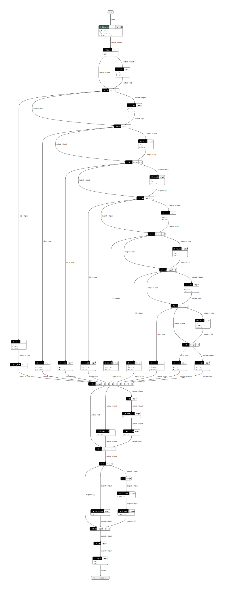

<!--- Licensed to the Apache Software Foundation (ASF) under one -->
<!--- or more contributor license agreements.  See the NOTICE file -->
<!--- distributed with this work for additional information -->
<!--- regarding copyright ownership.  The ASF licenses this file -->
<!--- to you under the Apache License, Version 2.0 (the -->
<!--- "License"); you may not use this file except in compliance -->
<!--- with the License.  You may obtain a copy of the License at -->

<!---   http://www.apache.org/licenses/LICENSE-2.0 -->

<!--- Unless required by applicable law or agreed to in writing, -->
<!--- software distributed under the License is distributed on an -->
<!--- "AS IS" BASIS, WITHOUT WARRANTIES OR CONDITIONS OF ANY -->
<!--- KIND, either express or implied.  See the License for the -->
<!--- specific language governing permissions and limitations -->
<!--- under the License. -->

# Optimizing Deep Learning Computation Graphs with TensorRT

NVIDIA's TensorRT is a deep learning library that has been shown to provide large speedups when used for network inference. MXNet 1.5.0 and later versions ship with experimental integrated support for TensorRT. This means MXNet users can now make use of this acceleration library to efficiently run their networks. In this tutorial we'll see how to install, enable and run TensorRT with MXNet.  We'll also give some insight into what is happening behind the scenes in MXNet to enable TensorRT graph execution.

## Installation and Prerequisites
To use MXNet with TensorRT integration you'll have to follow the MXNet build from source instructions, and have a few extra packages installed on your machine. First ensure that you are running Ubuntu 18.04, and that you have updated your video drivers, and you have installed CUDA 10.1 or newer.  You'll need a Pascal or newer generation NVIDIA GPU.  You'll also have to download and install TensorRT libraries [instructions here](https://docs.nvidia.com/deeplearning/sdk/tensorrt-install-guide/index.html).  Once you have these prerequisites installed you can follow the [recommended instructions for building MXNet for NVIDIA GPUs](https://mxnet.apache.org/get_started/build_from_source#recommended-for-Systems-with-NVIDIA-GPUs-and-Intel-CPUs) but include the additional CMake flag -DUSE_TENSORRT=1.

## Sample Models
### Resnet 18
TensorRT is an inference only library, so for the purposes of this tutorial we will be using a pre-trained network, in this case a Resnet 18.  Resnets are a computationally intensive model architecture that are often used as a backbone for various computer vision tasks. Resnets are also commonly used as a reference for benchmarking deep learning library performance.  In this section we'll use a pretrained Resnet 18 from the [Gluon Model Zoo](/api/python/docs/api/gluon/model_zoo/index.html) and compare its inference speed with TensorRT using MXNet with TensorRT integration turned off as a baseline.

## Model Initialization
```python
import mxnet as mx
from mxnet.gluon.model_zoo import vision
import time
import os

batch_shape = (1, 3, 224, 224)
resnet18 = vision.resnet18_v2(pretrained=True)
resnet18.hybridize()
resnet18.forward(mx.nd.zeros(batch_shape))
resnet18.export('resnet18_v2')
sym, arg_params, aux_params = mx.model.load_checkpoint('resnet18_v2', 0)
```
In our first section of code we import the modules needed to run MXNet, and to time our benchmark runs.  We then download a pretrained version of Resnet18, hybridize it, and load it symbolically.  It's important to note that the experimental version of TensorRT integration will only work with the symbolic MXNet API. If you're using Gluon, you must [hybridize](https://gluon.mxnet.io/chapter07_distributed-learning/hybridize.html) your computation graph and export it as a symbol before running inference.  This may be addressed in future releases of MXNet, but in general if you're concerned about getting the best inference performance possible from your models, it's a good practice to hybridize.

## MXNet Baseline Performance
```python
# Create sample input
input = mx.nd.zeros(batch_shape)

# Execute with MXNet
executor = sym.simple_bind(ctx=mx.gpu(0), data=batch_shape, grad_req='null', force_rebind=True)
executor.copy_params_from(arg_params, aux_params)

# Warmup
print('Warming up MXNet')
for i in range(0, 10):
    y_gen = executor.forward(is_train=False, data=input)
    y_gen[0].wait_to_read()

# Timing
print('Starting MXNet timed run')
start = time.process_time()
for i in range(0, 10000):
    y_gen = executor.forward(is_train=False, data=input)
    y_gen[0].wait_to_read()
end = time.time()
print(time.process_time() - start)
```

We are interested in inference performance, so to simplify the benchmark we'll pass a tensor filled with zeros as an input.  We bind a symbol as usual, returning an MXNet executor, and we run forward on this executor in a loop.  To help improve the accuracy of our benchmarks we run a small number of predictions as a warmup before running our timed loop.  On a modern PC with an RTX 2070 GPU the time taken for our MXNet baseline is **17.20s**.  Next we'll run the same model with TensorRT enabled, and see how the performance compares.

## MXNet with TensorRT Integration Performance
```python
# Execute with TensorRT
print('Building TensorRT engine')
trt_sym = sym.get_backend_symbol('TensorRT')
arg_params, aux_params = mx.contrib.tensorrt.init_tensorrt_params(trt_sym, arg_params, aux_params)
mx.contrib.tensorrt.set_use_fp16(True)
executor = trt_sym.simple_bind(ctx=mx.gpu(), data=batch_shape,
                               grad_req='null', force_rebind=True)
executor.copy_params_from(arg_params, aux_params)
```

We use a few TensorRT specific API calls from the contrib package here to setup our parameters and indicate we'd like to run inference in fp16 mode. We then call simple_bind as normal and copy our parameter dictionaries to our executor.

```python
#Warmup
print('Warming up TensorRT')
for i in range(0, 10):
    y_gen = executor.forward(is_train=False, data=input)
    y_gen[0].wait_to_read()

# Timing
print('Starting TensorRT timed run')
start = time.process_time()
for i in range(0, 10000):
    y_gen = executor.forward(is_train=False, data=input)
    y_gen[0].wait_to_read()
end = time.time()
print(time.process_time() - start)
```

We run timing with a warmup once more, and on the same machine, run in **9.83s**. A 1.75x speed improvement!  Speed improvements when using libraries like TensorRT can come from a variety of optimizations, but in this case our speedups are coming from a technique known as [operator fusion](http://ziheng.org/2016/11/21/fusion-and-runtime-compilation-for-nnvm-and-tinyflow/).

## Operators and Subgraph Fusion

Behind the scenes a number of interesting things are happening to make these optimizations possible, and most revolve around subgraphs and operator fusion.  As we can see in the images below, neural networks can be represented as computation graphs of operators (nodes in the graphs).  Operators can perform a variety of functions, but most run simple mathematics and linear algebra on tensors.  Often these operators run more efficiently if fused together into a large CUDA kernel that is executed on the GPU in a single call.  What the MXNet TensorRT integration enables is the ability to scan the entire computation graph, identify interesting subgraphs and optimize them with TensorRT.

This means that when an MXNet computation graph is constructed, it will be parsed to determine if there are any sub-graphs that contain operator types that are supported by TensorRT.  If MXNet determines that there are one (or many) compatible subgraphs during the graph-parse, it will extract these graphs and replace them with special TensorRT nodes (visible in the diagrams below).  As the graph is executed, whenever a TensorRT node is reached the graph will make a library call to TensorRT.  TensorRT will then run its own implementation of the subgraph, potentially with many operators fused together into a single CUDA kernel.

During this process MXNet will take care of passing along the input to the node and fetching the results.  MXNet will also attempt to remove any duplicated weights (parameters) during the graph initialization to keep memory usage low.  That is, if there are graph weights that are used only in the TensorRT sections of the graph, they will be removed from the MXNet set of parameters, and their memory will be freed.

The examples below shows a Gluon implementation of a Wavenet before and after a TensorRT graph pass. You can see that for this network TensorRT supports a subset of the operators involved. This makes it an interesting example to visualize, as several subgraphs are extracted and replaced with special TensorRT nodes. The Resnet used as an example above would be less interesting to visualization. The entire Resnet graph is supported by TensorRT, and hence the optimized graph would be a single TensorRT node.  If your browser is unable to render svg files you can view the graphs in png format: [unoptimized](wavenet_unoptimized.svg) and [optimized](wavenet_optimized.svg).

## Before


## After


## Subgraph API
As of MXNet 1.5, MXNet developers have integrated TensorRT with MXNet via a Subgraph API.  Read more about the design of the API [here](https://cwiki.apache.org/confluence/display/MXNET/MXNet+Graph+Optimization+and+Quantization+based+on+subgraph+and+MKL-DNN).

## Thanks
Thanks to NVIDIA for contributing this feature, and specifically thanks to Marek Kolodziej and Clement Fuji-Tsang.  Thanks to Junyuan Xie and Jun Wu for the code reviews and design feedback, and to Aaron Markham for the copy review.