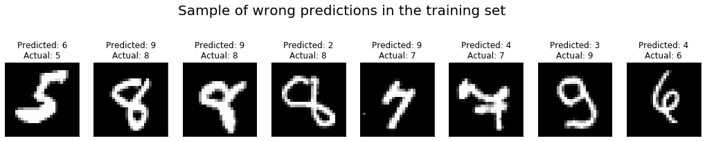
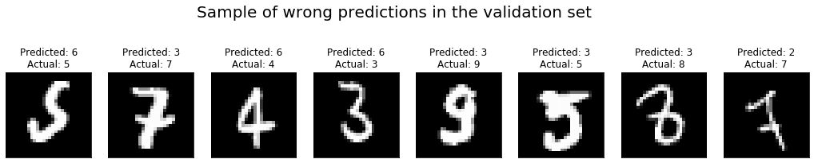

# Hand-written Digit Recognition

In this tutorial, we'll give you a step-by-step walkthrough of building a hand-written digit classifier using the [MNIST](https://en.wikipedia.org/wiki/MNIST_database) dataset.

MNIST is a widely used dataset for the hand-written digit classification task. It consists of 70,000 labeled grayscale images of hand-written digits, each 28x28 pixels in size. The dataset is split into 60,000 training images and 10,000 test images. There are 10 classes (one for each of the 10 digits). The task at hand is to train a model that can correctly classify the images into the digits they represent. The 60,000 training images are used to fit the model, and its performance in terms of classification accuracy is subsequently validated on the 10,000 test images.


**Figure 1:** Sample images from the MNIST dataset.

This tutorial uses MXNet's high-level *Gluon* interface to implement neural networks in an imperative fashion. It is based on [the corresponding tutorial written with the symbolic approach](https://mxnet.io/tutorials/python/mnist.html).

## Prerequisites

To complete this tutorial, you need:

- MXNet. See the instructions for your operating system in [Setup and Installation](https://mxnet.io/install/index.html).
- The Python [`requests`](http://docs.python-requests.org/en/master/) library.
- (Optional) The [Jupyter Notebook](https://jupyter.org/index.html) software for interactively running the provided `.ipynb` file.

```
$ pip install requests jupyter
```

## Loading Data

The following code downloads the MNIST dataset to the default location (`.mxnet/datasets/mnist/` in your home directory) and creates `Dataset` objects `train_data` and `val_data` for training and validation, respectively.
These objects can later be used to get one image or a batch of images at a time, together with their corresponding labels.

We also add a `transform` function that rescales the images from `[0, 255]` to `[0, 1]`.

```python
import mxnet as mx

# Select a fixed random seed for reproducibility
mx.random.seed(42)

train_data = mx.gluon.data.vision.MNIST(
    train=True,
    transform=lambda data, label: (data.astype("float32") / 255, label),
)
val_data = mx.gluon.data.vision.MNIST(
    train=False,
    transform=lambda data, label: (data.astype("float32") / 255, label),
)
```

Since the MNIST dataset is relatively small, this class loads it into memory all at once, but for larger datasets like ImageNet, this would no longer be possible.
The Gluon `Dataset` class from which `MNIST` derives supports both cases.
In general, `Dataset` and `DataLoader` (which we'll see in a second) are the machinery in MXNet that provides a stream of input data to be consumed by a training algorithm, typically in batches of multiple data entities at once for better efficiency.
In this tutorial, we will configure the data loader to feed examples in batches of 100.

An image batch is commonly represented by a 4-D array with shape `(batch_size, num_channels, height, width)`.
This convention is denoted by "BCHW", and it is the default in MXNet.
For the MNIST dataset, each image has a size of 28x28 pixels and one color channel (grayscale), hence the shape of an input batch will be `(batch_size, 1, 28, 28)`.

Another important consideration is the order of input samples.
When feeding training examples, it is critical not feed samples with the same label in succession since doing so can slow down training.
Data iterators take care of this issue by randomly shuffling the inputs.
Note that we only need to shuffle the training data -- for validation data, the order does not matter.

The following code initializes the data iterators for the MNIST dataset.

```python
batch_size = 100
train_loader = mx.gluon.data.DataLoader(train_data, shuffle=True, batch_size=batch_size)
val_loader = mx.gluon.data.DataLoader(val_data, shuffle=False, batch_size=batch_size)
```

## Approaches

We will cover a couple of approaches for performing the hand-written digit recognition task.
In our first attempt, we will make use of a traditional deep neural network architecture called Multilayer Perceptron (MLP).
Although this architecture gets us up to about 95.5 % accuracy on the validation set, we will recognize and discuss some of its drawbacks and use them as a motivation for using a different network.
In that second attempt, we introduce the more advanced and very widely used Convolutional Neural Network (CNN) architecture that has proven to work very well for image classification tasks.

As a first step, we do some convenience imports of frequently used modules.

```python
from __future__ import print_function  # only relevant for Python 2
import mxnet as mx
from mxnet import nd, gluon, autograd
from mxnet.gluon import nn
```

### Define a network: Multilayer Perceptron

MLPs consist of several fully connected layers.
In a fully connected (short: FC) layer, each neuron is connected to every neuron in its preceding layer.
From a linear algebra perspective, an FC layer applies an [affine transform](https://en.wikipedia.org/wiki/Affine_transformation) *Y = X W + b* to an input matrix *X* of size (*n x m*) and outputs a matrix *Y* of size (*n x k*).
The number *k*, also referred to as *hidden size*, corresponds to the number of neurons in the FC layer.
An FC layer has two learnable parameters: the (*m x k*) weight matrix *W* and the (*1 x k*) bias vector *b*.

In an MLP, the outputs of FC layers are typically fed into an activation function that applies an elementwise nonlinearity.
This step is crucial since it gives neural networks the ability to classify inputs that are not linearly separable.
Common choices for activation functions are [sigmoid](https://en.wikipedia.org/wiki/Sigmoid_function), [hyperbolic tangent ("tanh")](https://en.wikipedia.org/wiki/Hyperbolic_function#Definitions), and [rectified linear unit (ReLU)](https://en.wikipedia.org/wiki/Rectifier_(neural_networks)).
In this example, we'll use the ReLU activation function since it has several nice properties that make it a good default choice.

The following code declares three fully connected (or *dense*) layers with 128, 64 and 10 neurons each, where the last number of neurons matches the number of output classes in our dataset.
To build the neural network, we use a [`Sequential` layer](https://mxnet.io/api/python/gluon/gluon.html#mxnet.gluon.nn.Sequential), which is a convenience class to build a linear stack of layers, often called a *feed-forward neural net*.

```python
net = nn.Sequential()
with net.name_scope():
    net.add(nn.Dense(128, activation='relu'))
    net.add(nn.Dense(64, activation='relu'))
    net.add(nn.Dense(10))
```

#### Initialize parameters and optimizer

Before the network can be used, its parameters (weight and bias) need to be set to initial values that are sufficiently random while keeping the magnitude of gradients limited.
The [Xavier](https://mxnet.io/api/python/optimization/optimization.html#mxnet.initializer.Xavier) initializer is usually a good default choice.

Since the `net.initialize()` method creates arrays for its parameters, it needs to know where to store the values: in CPU or GPU memory.
Like many other functions and classes that deal with memory management in one way or another, it takes an optional `ctx` (short for *context*) argument, where the return value of either `mx.cpu()` or `mx.gpu()` can be provided.

```python
ctx = mx.gpu(0) if mx.context.num_gpus() > 0 else mx.cpu(0)
net.initialize(mx.init.Xavier(), ctx=ctx)
```

To train the network parameters, we will make use of the [stochastic gradient descent (SGD)](https://en.wikipedia.org/wiki/Stochastic_gradient_descent) optimizer.
More specifically, we use mini-batch SGD in contrast to the classical SGD that processes one example at a time, which is very slow in practice.
(Recall that we set the batch size to 100 in the ["Loading Data"](#loading-data) part.)

Besides the batch size, the SGD algorithm has one important *hyperparameter*: the *learning rate*.
It determines the size of steps that the algorithm takes in search of parameters that allow the network to optimally fit the training data, and as such it has great influence on both the course of the training process and its final outcome.
In general, hyperparameters refer to *non-learnable* values that need to be chosen before training and that have an effect on the outcome.
In this example, further hyperparameters are the number of layers in the network, the number of neurons of the first two layers, the activation function and (later) the loss function.

The SGD optimization method can be accessed in MXNet Gluon through the [`Trainer`](https://mxnet.io/api/python/gluon/gluon.html#trainer) class.
Internally, it makes use of the [`SGD`](https://mxnet.io/api/python/optimization/optimization.html#mxnet.optimizer.SGD) optimizer class.

```python
trainer = gluon.Trainer(
    params=net.collect_params(),
    optimizer='sgd',
    optimizer_params={'learning_rate': 0.02},
)
```

#### Train the network

Training the network requires a way to tell how well the network currently fits the training data, or how badly, expressed as a "loss" value, as it is customary in optimization.
Ideally, in a classification task, we would use the prediction inaccuracy, i.e., the fraction of incorrectly classified samples, to guide the training to a lower value.
Unfortunately, inaccuracy is a poor choice for training since it contains almost no information that can be used to update the network parameters (its gradient is zero almost everywhere).

As a better behaved proxy for inaccuracy, the [softmax cross-entropy loss](https://mxnet.incubator.apache.org/api/python/gluon/loss.html#mxnet.gluon.loss.SoftmaxCrossEntropyLoss) is a popular choice.
It has the essential property of being minimal for the correct prediction, but at the same time, it is everywhere differentiable with nonzero gradient.

We only use [accuracy](https://mxnet.incubator.apache.org/api/python/metric/metric.html#mxnet.metric.Accuracy) to monitor the training progress, since it is more intuitively interpretable.

```python
metric = mx.metric.Accuracy()
loss_function = gluon.loss.SoftmaxCrossEntropyLoss()
```

Typically, the training is run until convergence, which means that further iterations will not improve the result any more, and that the network has probably learned a good set of model parameters from the train data.
For the purpose of this tutorial, we only loop 10 times over the entire dataset; one such pass over the data is usually called an *epoch*.

The following steps are taken in each `epoch`:

- Get a minibatch of `inputs` and `labels` from the `train_loader`.
- Feed the `inputs` to the network, producing `outputs`.
- Compute the minibatch loss value by comparing `outputs` to `labels`.
- Backpropagate the gradients to update the network parameters.
- Print the current accuracy over the training data, i.e., the fraction of correctly classified training examples.

```python
num_epochs = 10

for epoch in range(num_epochs):
    for inputs, labels in train_loader:
        # Possibly copy inputs and labels to the GPU
        inputs = inputs.as_in_context(ctx)
        labels = labels.as_in_context(ctx)

        # The forward pass and the loss computation need to be wrapped
        # in a `record()` scope to indicate that the results will
        # be needed in the backward pass (gradient computation).
        with autograd.record():
            outputs = net(inputs)
            loss = loss_function(outputs, labels)

        # Compute gradients by backpropagation and update the evaluation
        # metric
        loss.backward()
        metric.update(labels, outputs)

        # Update the parameters by stepping the trainer; the batch size
        # is required to normalize the gradients by `1 / batch_size`.
        trainer.step(batch_size=inputs.shape[0])

    # Print the evaluation metric and reset it for the next epoch
    name, acc = metric.get()
    print('After epoch {}: {} = {}'.format(epoch + 1, name, acc))
    metric.reset()
```

#### Prediction

When the above training has completed, we can evaluate the trained model by running predictions on validation dataset.
Since the dataset also has labels for all test images, we can compute the accuracy metric over validation data as follows:

```python
metric = mx.metric.Accuracy()
for inputs, labels in val_loader:
    # Possibly copy inputs and labels to the GPU
    inputs = inputs.as_in_context(ctx)
    labels = labels.as_in_context(ctx)
    metric.update(labels, net(inputs))
print('Validaton: {} = {}'.format(*metric.get()))
assert metric.get()[1] > 0.94
```

If everything went well, we should see an accuracy value that is around 0.954, which means that we are able to accurately predict the digit in 95.5 % of test images.
This is a pretty good result, but as we will see in the next part of this tutorial, we can do a lot better than that.

That said, a single number only conveys very limited information on the performance of our neural network.
It is always a good idea to actually look at the images on which the network performed poorly, and check for clues on how to improve the performance.
We do that with the help of a small function that produces a list of the images which the network got wrong, together with the predicted and true labels.

```python
def get_mislabelled(loader):
    """Return list of ``(input, pred_lbl, true_lbl)`` for mislabelled samples."""
    mislabelled = []
    for inputs, labels in loader:
        inputs = inputs.as_in_context(ctx)
        labels = labels.as_in_context(ctx)
        outputs = net(inputs)
        # Predicted label is the index is where the output is maximal
        preds = nd.argmax(outputs, axis=1)
        for i, p, l in zip(inputs, preds, labels):
            if p != l:
                mislabelled.append(
                    (i.asnumpy(), int(p.asnumpy()), int(l.asnumpy()))
                )
    return mislabelled
```

We can now get the mislabelled images in the training and validation sets and plot a selection of them:

```python
import numpy as np

sample_size = 8
wrong_train = get_mislabelled(train_loader)
wrong_val = get_mislabelled(val_loader)
wrong_train_sample = [wrong_train[i] for i in np.random.randint(0, len(wrong_train), size=sample_size)]
wrong_val_sample = [wrong_val[i] for i in np.random.randint(0, len(wrong_val), size=sample_size)]

import matplotlib.pyplot as plt

fig, axs = plt.subplots(ncols=sample_size)
for ax, (img, pred, lbl) in zip(axs, wrong_train_sample):
    fig.set_size_inches(18, 4)
    fig.suptitle("Sample of wrong predictions in the training set", fontsize=20)
    ax.imshow(img[0], cmap="gray")
    ax.set_title("Predicted: {}\nActual: {}".format(pred, lbl))
    ax.xaxis.set_visible(False)
    ax.yaxis.set_visible(False)

fig, axs = plt.subplots(ncols=sample_size)
for ax, (img, pred, lbl) in zip(axs, wrong_val_sample):
    fig.set_size_inches(18, 4)
    fig.suptitle("Sample of wrong predictions in the validation set", fontsize=20)
    ax.imshow(img[0], cmap="gray")
    ax.set_title("Predicted: {}\nActual: {}".format(pred, lbl))
    ax.xaxis.set_visible(False)
    ax.yaxis.set_visible(False)
```



In this case, it is rather obvious that our MLP network is either too simple or not trained long enough to perform really great on this dataset, as can be seen from the fact that some of the mislabelled examples are rather "easy" and should not be a challenge for our neural net.
As it turns out, moving to the CNN architecture presented in the following section will give a big performance boost.

### Convolutional Neural Network

Earlier, we briefly touched on a drawback of MLP when we said we need to discard the input image's original shape and flatten it as a vector before we can feed it as input to the MLP's first fully connected layer. Turns out this is an important issue because we don't take advantage of the fact that pixels in the image have natural spatial correlation along the horizontal and vertical axes. A convolutional neural network (CNN) aims to address this problem by using a more structured weight representation. Instead of flattening the image and doing a simple matrix-matrix multiplication, it employs one or more convolutional layers that each performs a 2-D convolution on the input image.

A single convolution layer consists of one or more filters that each play the role of a feature detector. During training, a CNN learns appropriate representations (parameters) for these filters. Similar to MLP, the output from the convolutional layer is transformed by applying a non-linearity. Besides the convolutional layer, another key aspect of a CNN is the pooling layer. A pooling layer serves to make the CNN translation invariant: a digit remains the same even when it is shifted left/right/up/down by a few pixels. A pooling layer reduces a *n x m* patch into a single value to make the network less sensitive to the spatial location. Pooling layer is always included after each conv (+ activation) layer in the CNN.

The following source code defines a convolutional neural network architecture called LeNet. LeNet is a popular network known to work well on digit classification tasks. We will use a slightly different version from the original LeNet implementation, replacing the sigmoid activations with tanh activations for the neurons.

A typical way to write your network is creating a new class inherited from `gluon.Block`
class. We can define the network by composing and inheriting Block class as follows:

```python
import mxnet.ndarray as F

class Net(gluon.Block):
    def __init__(self, **kwargs):
        super(Net, self).__init__(**kwargs)
        with self.name_scope():
            # layers created in name_scope will inherit name space
            # from parent layer.
            self.conv1 = nn.Conv2D(20, kernel_size=(5,5))
            self.pool1 = nn.MaxPool2D(pool_size=(2,2), strides = (2,2))
            self.conv2 = nn.Conv2D(50, kernel_size=(5,5))
            self.pool2 = nn.MaxPool2D(pool_size=(2,2), strides = (2,2))
            self.fc1 = nn.Dense(500)
            self.fc2 = nn.Dense(10)

    def forward(self, x):
        x = self.pool1(F.tanh(self.conv1(x)))
        x = self.pool2(F.tanh(self.conv2(x)))
        # 0 means copy over size from corresponding dimension.
        # -1 means infer size from the rest of dimensions.
        x = x.reshape((0, -1))
        x = F.tanh(self.fc1(x))
        x = F.tanh(self.fc2(x))
        return x
```

We just defined the forward function here, and the backward function to compute gradients
is automatically defined for you using autograd.
We also imported `mxnet.ndarray` package to use activation functions from `ndarray` API.

Now, We will create the network as follows:

```python
net = Net()
```


**Figure 3:** First conv + pooling layer in LeNet.

Now we train LeNet with similar hyper-parameters as before. Note that, if a GPU is available, we recommend using it. This greatly speeds up computation given that LeNet is more complex and compute-intensive than the previous multilayer perceptron. To do so, we only need to change `mx.cpu()` to `mx.gpu()` and MXNet takes care of the rest. Just like before, we'll stop training after 10 epochs.

Training and prediction can be done in the similar way as we did for MLP.

#### Initialize parameters and optimizer

We will initialize the network parameters as follows:

```python
# set the context on GPU is available otherwise CPU
ctx = [mx.gpu() if mx.test_utils.list_gpus() else mx.cpu()]
net.initialize(mx.init.Xavier(magnitude=2.24), ctx=ctx)
trainer = gluon.Trainer(net.collect_params(), 'sgd', {'learning_rate': 0.03})
```

#### Training

```python
# Use Accuracy as the evaluation metric.
metric = mx.metric.Accuracy()
softmax_cross_entropy_loss = gluon.loss.SoftmaxCrossEntropyLoss()

for i in range(num_epochs):
    # Reset the train data iterator.
    train_data.reset()
    # Loop over the train data iterator.
    for batch in train_data:
        # Splits train data into multiple slices along batch_axis
        # and copy each slice into a context.
        data = gluon.utils.split_and_load(batch.data[0], ctx_list=ctx, batch_axis=0)
        # Splits train labels into multiple slices along batch_axis
        # and copy each slice into a context.
        label = gluon.utils.split_and_load(batch.label[0], ctx_list=ctx, batch_axis=0)
        outputs = []
        # Inside training scope
        with ag.record():
            for x, y in zip(data, label):
                z = net(x)
                # Computes softmax cross entropy loss.
                loss = softmax_cross_entropy_loss(z, y)
                # Backpropogate the error for one iteration.
                loss.backward()
                outputs.append(z)
        # Updates internal evaluation
        metric.update(label, outputs)
        # Make one step of parameter update. Trainer needs to know the
        # batch size of data to normalize the gradient by 1/batch_size.
        trainer.step(batch.data[0].shape[0])
    # Gets the evaluation result.
    name, acc = metric.get()
    # Reset evaluation result to initial state.
    metric.reset()
    print('training acc at epoch %d: %s=%f'%(i, name, acc))
```

#### Prediction

Finally, we'll use the trained LeNet model to generate predictions for the test data.

```python
# Use Accuracy as the evaluation metric.
metric = mx.metric.Accuracy()
# Reset the validation data iterator.
val_data.reset()
# Loop over the validation data iterator.
for batch in val_data:
    # Splits validation data into multiple slices along batch_axis
    # and copy each slice into a context.
    data = gluon.utils.split_and_load(batch.data[0], ctx_list=ctx, batch_axis=0)
    # Splits validation label into multiple slices along batch_axis
    # and copy each slice into a context.
    label = gluon.utils.split_and_load(batch.label[0], ctx_list=ctx, batch_axis=0)
    outputs = []
    for x in data:
        outputs.append(net(x))
    # Updates internal evaluation
    metric.update(label, outputs)
print('validation acc: %s=%f'%metric.get())
assert metric.get()[1] > 0.98
```

If all went well, we should see a higher accuracy metric for predictions made using LeNet. With CNN we should be able to correctly predict around 98% of all test images.

## Summary

In this tutorial, we have learned how to use MXNet to solve a standard computer vision problem: classifying images of hand-written digits. You have seen how to quickly and easily build, train and evaluate models such as MLP and CNN with MXNet Gluon package.

<!-- INSERT SOURCE DOWNLOAD BUTTONS -->
