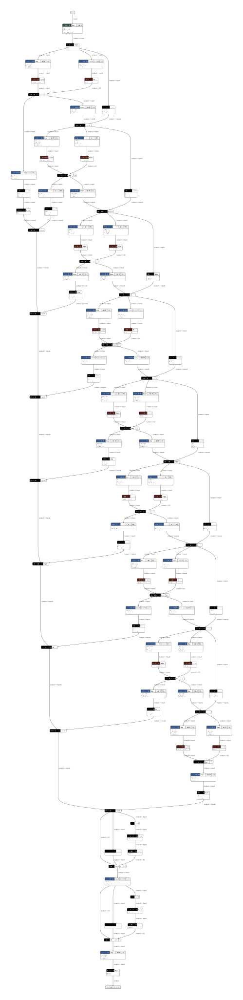

<!--- Licensed to the Apache Software Foundation (ASF) under one -->
<!--- or more contributor license agreements.  See the NOTICE file -->
<!--- distributed with this work for additional information -->
<!--- regarding copyright ownership.  The ASF licenses this file -->
<!--- to you under the Apache License, Version 2.0 (the -->
<!--- "License"); you may not use this file except in compliance -->
<!--- with the License.  You may obtain a copy of the License at -->

<!---   http://www.apache.org/licenses/LICENSE-2.0 -->

<!--- Unless required by applicable law or agreed to in writing, -->
<!--- software distributed under the License is distributed on an -->
<!--- "AS IS" BASIS, WITHOUT WARRANTIES OR CONDITIONS OF ANY -->
<!--- KIND, either express or implied.  See the License for the -->
<!--- specific language governing permissions and limitations -->
<!--- under the License. -->

# Optimizing Deep Learning Computation Graphs with TensorRT

NVIDIA's TensorRT is a deep learning library that has been shown to provide large speedups when used for network inference. MXNet 1.3.0 is shipping with experimental integrated support for TensorRT. This means MXNet users can noew make use of this acceleration library to efficiently run their networks. In this blog post we'll see how to install, enable and run TensorRT with MXNet.  We'll also give some insight into what is happening behind the scenes in MXNet to enable TensorRT graph execution.

## Installation and Prerequisites
Installing MXNet with TensorRT integration is an easy process. First ensure that you are running Ubuntu 16.04, that you have updated your video drivers, and you have installed CUDA 9.0 or 9.2.  You'll need a Pascal or newer generation NVIDIA gpu.  You'll also have to download and install TensorRT libraries [instructions here](https://docs.nvidia.com/deeplearning/sdk/tensorrt-install-guide/index.html).  Once your these prerequisites installed and up-to-date you can install a special build of MXNet with TensorRT support enabled via PyPi and pip.  Install the appropriate version by running:

To install with CUDA 9.0:
```
pip install mxnet-tensorrt-cu90
```

To install with CUDA 9.2:
```
pip install mxnet-tensorrt-cu92
```

If you are running an operating system other than Ubuntu 16.04, or just prefer to use a docker image with all prerequisites installed you can instead run:
```
nvidia-docker run -ti mxnet/tensorrt python
```

## Sample Models
### Resnet 18
TensorRT is an inference only library, so for the purposes of this blog post we will be using a pre-trained network, in this case a Resnet 18.  Resnets are a computationally intensive model architecture that are often used as a backbone for various computer vision tasks. Resnets are also commonly used as a reference for benchmarking deep learning library performance.  In this section we'll use a pretrained Resnet 18 from the [Gluon Model Zoo](https://mxnet.incubator.apache.org/versions/master/api/python/gluon/model_zoo.html) and compare its inference speed with TensorRT using MXNet with TensorRT integration turned off as a baseline.

## Model Initialization
```python
import mxnet as mx
from mxnet.gluon.model_zoo import vision
import time
import os

batch_shape = (1, 3, 224, 224)
resnet18 = vision.resnet18_v2(pretrained=True)
resnet18.hybridize()
resnet18.forward(mx.nd.zeros(batch_shape))
resnet18.export('resnet18_v2')
sym, arg_params, aux_params = mx.model.load_checkpoint('resnet18_v2', 0)
```
In our first section of code we import the modules needed to run MXNet, and to time our benchmark runs.  We then download a pretrained version of Resnet18, hybridize it, and load it symbolically.  It's important to note that the experimental version of TensorRT integration will only work with the symbolic MXNet API. If you're using Gluon, you must [hybridize](https://gluon.mxnet.io/chapter07_distributed-learning/hybridize.html) your computation graph and export it as a symbol before running inference.  This may be addressed in future releases of MXNet, but in general if you're concerned about getting the best inference performance possible from your models, it's a good practice to hybridize.

## MXNet Baseline Performance
```python
# Create sample input
input = mx.nd.zeros(batch_shape)

# Execute with MXNet
os.environ['MXNET_USE_TENSORRT'] = '0'
executor = sym.simple_bind(ctx=mx.gpu(0), data=batch_shape, grad_req='null', force_rebind=True)
executor.copy_params_from(arg_params, aux_params)

# Warmup
print('Warming up MXNet')
for i in range(0, 10):
    y_gen = executor.forward(is_train=False, data=input)
    y_gen[0].wait_to_read()

# Timing
print('Starting MXNet timed run')
start = time.process_time()
for i in range(0, 10000):
    y_gen = executor.forward(is_train=False, data=input)
    y_gen[0].wait_to_read()
end = time.time()
print(time.process_time() - start)
```

For this experiment we are strictly interested in inference performance, so to simplify the benchmark we'll pass a tensor filled with zeros as an input.  We then bind a symbol as usual, returning a normal MXNet executor, and we run forward on this executor in a loop.  To help improve the accuracy of our benchmarks we run a small number of predictions as a warmup before running our timed loop.  This will ensure various lazy operations, which do not represent real-world usage, have completed before we measure relative performance improvement.  On a modern PC with a Titan V GPU the time taken for our MXNet baseline is **33.73s**.  Next we'll run the same model with TensorRT enabled, and see how the performance compares.

While TensorRT integration remains experimental, we require users to set an environment variable to enable graph compilation.  You can see that at the start of this test we explicitly disabled TensorRT graph compilation support.  Next, we will run the same predictions using TensorRT.  This will require us to explicitly enable the MXNET_USE_TENSORRT environment variable, and we'll also use a slightly different API to bind our symbol.

## MXNet with TensorRT Integration Performance
```python
# Execute with TensorRT
print('Building TensorRT engine')
os.environ['MXNET_USE_TENSORRT'] = '1'
arg_params.update(aux_params)
all_params = dict([(k, v.as_in_context(mx.gpu(0))) for k, v in arg_params.items()])
executor = mx.contrib.tensorrt.tensorrt_bind(sym, ctx=mx.gpu(0), all_params=all_params,
                                             data=batch_shape, grad_req='null', force_rebind=True)
```

Instead of calling simple_bind directly on our symbol to return an executor, we call an experimental API from the contrib module of MXNet. This call is meant to emulate the simple_bind call, and has many of the same arguments.  One difference to note is that this call takes params in the form of a single merged dictionary to assist with a tensor cleanup pass that we'll describe below.

As TensorRT integration improves our goal is to gradually deprecate this tensorrt_bind call, and allow users to use TensorRT transparently (see the [Subgraph API](https://cwiki.apache.org/confluence/display/MXNET/MXNet+Graph+Optimization+and+Quantization+based+on+subgraph+and+MKL-DNN) for more information).  When this happens, the similarity between tensorrt_bind and simple_bind should make it easy to migrate your code.

```
#Warmup
print('Warming up TensorRT')
for i in range(0, 10):
    y_gen = executor.forward(is_train=False, data=input)
    y_gen[0].wait_to_read()

# Timing
print('Starting TensorRT timed run')
start = time.process_time()
for i in range(0, 10000):
    y_gen = executor.forward(is_train=False, data=input)
    y_gen[0].wait_to_read()
end = time.time()
print(time.process_time() - start)
```
We run timing with a warmup once more, and on the same machine, run in **18.99s**. A 1.8x speed improvement!  Speed improvements when using libraries like TensorRT can come from a variety of optimizations, but in this case our speedups are coming from a technique known as [operator fusion](http://dmlc.ml/2016/11/21/fusion-and-runtime-compilation-for-nnvm-and-tinyflow.html).

## Operators and Subgraph Fusion

Behind the scenes a number of interesting things are happening to make these optimizations possible, and most revolve around subgraphs and operator fusion.  As we can see in the images below, neural networks can be represented as computation graphs of operators (nodes in the graphs).  Operators can perform a variety of functions, but most run simple mathematics and linear algebra on tensors.  Often these operators run more efficiently if fused together into a large CUDA kernel that is executed on the GPU in a single call.  What the MXNet TensorRT integration enables is the ability to scan the entire computation graph, identify interesting subgraphs and optimize them with TensorRT. 

This means that when an MXNet computation graph is constructed, it will be parsed to determine if there are any sub-graphs that contain operator types that are supported by TensorRT.  If MXNet determines that there are one (or many) compatible subgraphs during the graph-parse, it will extract these graphs and replace them with special TensorRT nodes (visible in the diagrams below).  As the graph is executed, whenever a TensorRT node is reached the graph will make a library call to TensorRT.  TensorRT will then run its own implementation of the subgraph, potentially with many operators fused together into a single CUDA kernel.

During this process MXNet will take care of passing along the input to the node and fetching the results.  MXNet will also attempt to remove any duplicated weights (parameters) during the graph initialization to keep memory usage low.  That is, if there are graph weights that are used only in the TensorRT sections of the graph, they will be removed from the MXNet set of parameters, and their memory will be freed.

The examples below shows a Gluon implementation of a Wavenet before and after a TensorRT graph pass. You can see that for this network TensorRT supports a subset of the operators involved. This makes it an interesting example to visualize, as several subgraphs are extracted and replaced with special TensorRT nodes. The Resnet used as an example above would be less interesting to visualization. The entire Resnet graph is supported by TensorRT, and hence the optimized graph would be a single TensorRT node.  If your browser is unable to render svg files you can view the graphs in png format: [unoptimized](wavenet_unoptimized.png) and [optimized](wavenet_optimized.png).

## Before


## After


## Future Work
As mentioned above, MXNet developers are excited about the possibilities of [creating APIs](https://cwiki.apache.org/confluence/display/MXNET/MXNet+Graph+Optimization+and+Quantization+based+on+subgraph+and+MKL-DNN) that deal specifically with subgraphs.  As this work matures it will bring many improvements for TensorRT users.  We hope this will also be an opportunity for other acceleration libraries to integrate with MXNet.

## Thanks
Thank you to NVIDIA for contributing this feature, and specifically thanks to Marek Kolodziej and Clement Fuji-Tsang.  Thanks to Junyuan Xie and Jun Wu for the code reviews and design feedback, and to Aaron Markham for the copy review.
