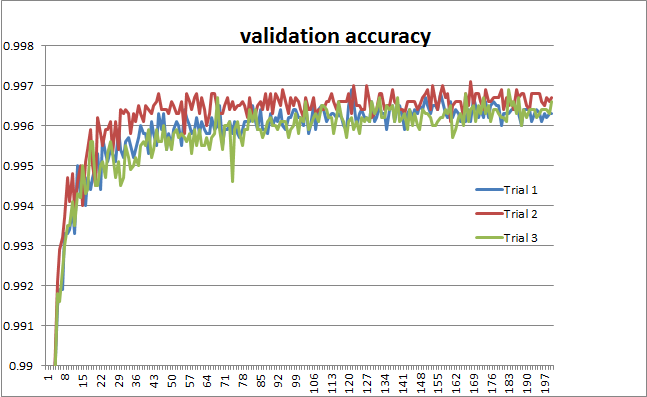

<!--- Licensed to the Apache Software Foundation (ASF) under one -->
<!--- or more contributor license agreements.  See the NOTICE file -->
<!--- distributed with this work for additional information -->
<!--- regarding copyright ownership.  The ASF licenses this file -->
<!--- to you under the Apache License, Version 2.0 (the -->
<!--- "License"); you may not use this file except in compliance -->
<!--- with the License.  You may obtain a copy of the License at -->

<!---   http://www.apache.org/licenses/LICENSE-2.0 -->

<!--- Unless required by applicable law or agreed to in writing, -->
<!--- software distributed under the License is distributed on an -->
<!--- "AS IS" BASIS, WITHOUT WARRANTIES OR CONDITIONS OF ANY -->
<!--- KIND, either express or implied.  See the License for the -->
<!--- specific language governing permissions and limitations -->
<!--- under the License. -->

**CapsNet-MXNet**
=========================================

This example is MXNet implementation of [CapsNet](https://arxiv.org/abs/1710.09829):  
Sara Sabour, Nicholas Frosst, Geoffrey E Hinton. Dynamic Routing Between Capsules. NIPS 2017
- The current `best test error is 0.29%` and `average test error is 0.303%`
- The `average test error on paper is 0.25%`  

Log files for the error rate are uploaded in [repository](https://github.com/samsungsds-rnd/capsnet.mxnet).  
* * *
## **Usage**
Install scipy with pip  
```
pip install scipy
```
Install tensorboard and mxboard with pip
```
pip install mxboard tensorflow
```

On Single gpu
```
python capsulenet.py --devices gpu0
```
On Multi gpus
```
python capsulenet.py --devices gpu0,gpu1
```
Full arguments  
```
python capsulenet.py --batch_size 100 --devices gpu0,gpu1 --num_epoch 100 --lr 0.001 --num_routing 3 --model_prefix capsnet
```  

* * *
## **Prerequisities**

MXNet version above (1.2.0)  
scipy version above (0.19.0)

***
## **Results**  
Train time takes about 36 seconds for each epoch (batch_size=100, 2 gtx 1080 gpus)  

CapsNet classification test error on MNIST:

```
python capsulenet.py --devices gpu0,gpu1 --lr 0.0005 --decay 0.99 --model_prefix lr_0_0005_decay_0_99 --batch_size 100 --num_routing 3 --num_epoch 200
```



| Trial | Epoch | train err(%) | test err(%) | train loss | test loss |
| :---: | :---: | :---: | :---: | :---: | :---: |
| 1 | 120 | 0.06 | 0.31 | 0.0056 | 0.0064 |
| 2 | 167 | 0.03 | 0.29 | 0.0048 | 0.0058 |
| 3 | 182 | 0.04 | 0.31 | 0.0046 | 0.0058 |
| average | - | 0.043 | 0.303 | 0.005 | 0.006 |

We achieved `the best test error rate=0.29%` and `average test error=0.303%`. It is the best accuracy and fastest training time result among other implementations(Keras, Tensorflow at 2017-11-23).
The result on paper is `0.25% (average test error rate)`.

| Implementation| test err(%) | ※train time/epoch | GPU  Used|
| :---: | :---: | :---: |:---: |
| MXNet | 0.29 | 36 sec | 2 GTX 1080 |
| tensorflow | 0.49 | ※ 10 min | Unknown(4GB Memory) |
| Keras | 0.30 | 55 sec | 2 GTX 1080 Ti |
