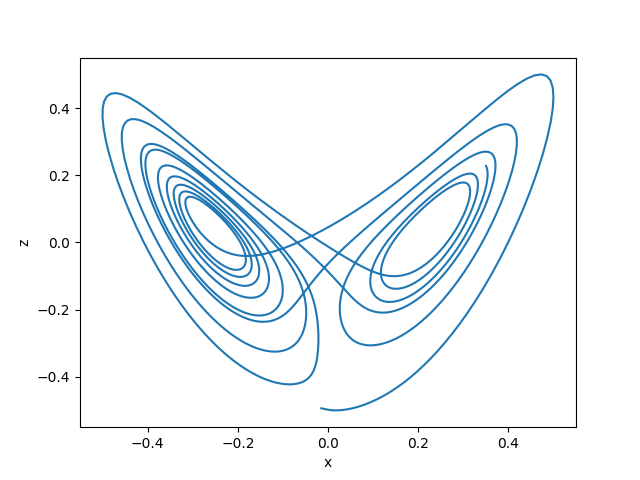
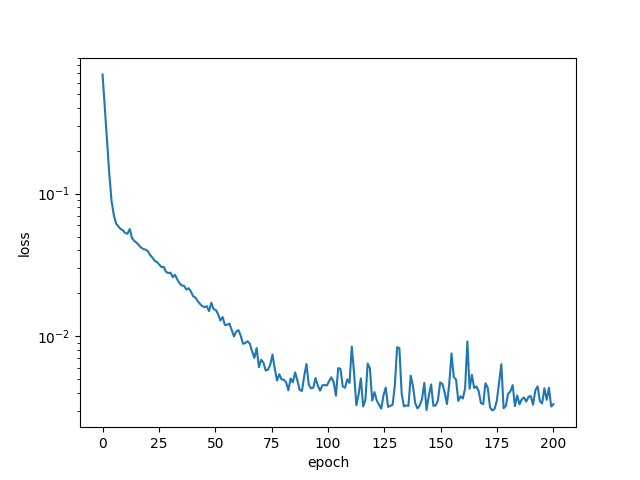
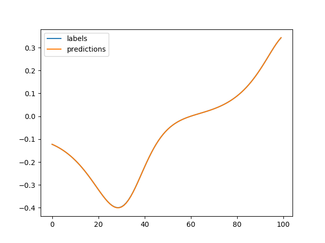

Licensed to the Apache Software Foundation (ASF) under one
or more contributor license agreements.  See the NOTICE file
distributed with this work for additional information
regarding copyright ownership.  The ASF licenses this file
to you under the Apache License, Version 2.0 (the
"License"); you may not use this file except in compliance
 with the License.  You may obtain a copy of the License at

   http://www.apache.org/licenses/LICENSE-2.0

 Unless required by applicable law or agreed to in writing,
 software distributed under the License is distributed on an
 "AS IS" BASIS, WITHOUT WARRANTIES OR CONDITIONS OF ANY
 KIND, either express or implied.  See the License for the
 specific language governing permissions and limitations
 under the License.

### End to end one step ahead time series prediction Gluon code for the article:

'Conditional Time Series Forecasting with Convolutional Neural Networks'

https://arxiv.org/abs/1703.04691

and

'Lorenz Trajectories Prediction: Travel Through Time'.
https://arxiv.org/abs/1903.07768

Plotting two of the three trajectories (z vs x) gives rise to the Lorenz butterfly.



### Training and inference
Model achieves on average the test RMSE reported in https://arxiv.org/abs/1703.04691). For the unconditional prediction
of the x trajectory, an average of 0.003 is achieved, with some variance.

## Requirements
- Python 3.6
- Mxnet 1.4.0
- tqdm

## Usage

- arguments
  - trajectory : Which Lorenz map trajectory to forecast one step ahead  (default=x)
  - model : Unconditional (only use x history to forecast x) or conditional (use historical x, y, z to forecast x)
  - in_channels: for unconditional = 1, for conditional = 3
  - batch_size : Define batch size (default=32)
  - epoches : Define total epoches (default=200)
  - dilation_depth : Define dilation depth (default=4)
  - num_gpu : Use GPU  (default=0)
  
## Default settings
```
python main.py
``` 

### Learning for Conditional model for x series one step ahead prediction:



### Predictions vs ground truth for x trajectory:


