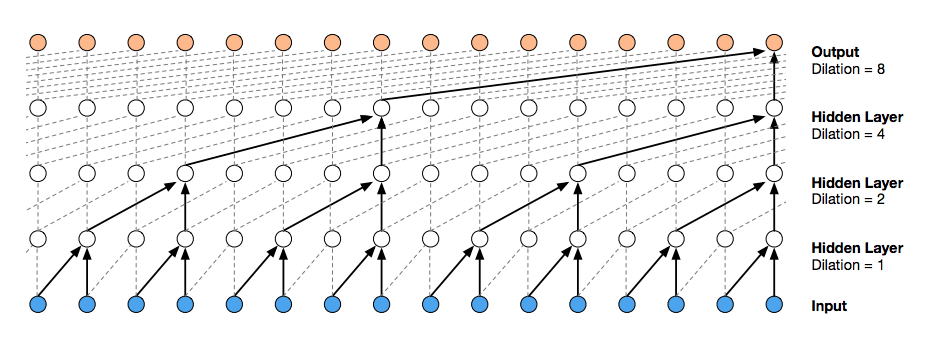
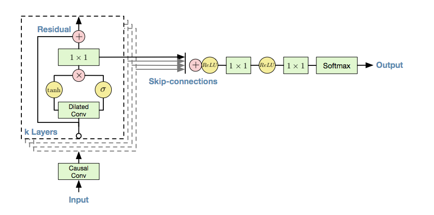
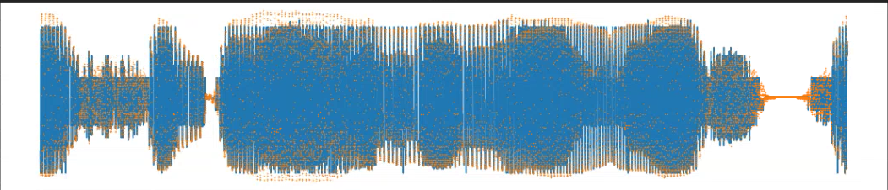
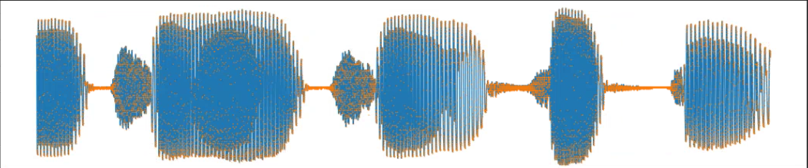
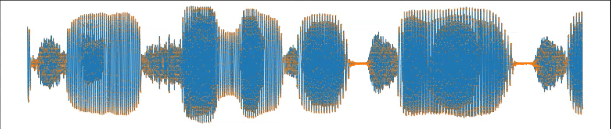
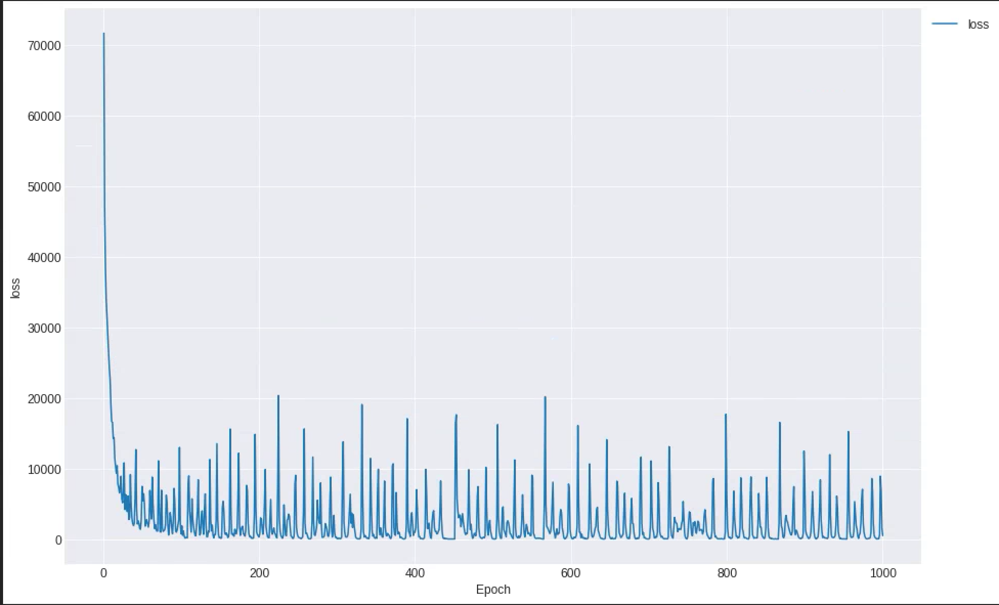

# WaveNet with Gluon

Gluon implementation of [WaveNet: A Generative Model for Raw Audio](https://arxiv.org/abs/1609.03499)




## Requirements
- Python 3.6.1
- Mxnet 1.2
- tqdm
- scipy.io


## Usage

- arguments
  - batch_size : Define batch size (defualt=64)
  - epoches : Define total epoches (default=1000)
  - mu : Define mu (default=128)
  - n_residue : Define number of residue (default=24)
  - dilation_depth : Define dilation depth (default=10)
  - use_gpu : Use GPU  (default=True)
  - generation : generate wav file for model (default=True)

###### default setting
```
python main.py
``` 
or

###### manual setting
```
python main.py --batch_size=32 --epoches=100 ...
```
## Train progress
###### 0 epoch


###### 200 epoch


###### 400 epoch



## Results


## Reference
- https://deepmind.com/blog/wavenet-generative-model-raw-audio/
- https://gist.github.com/lirnli/4282fcdfb383bb160cacf41d8c783c70#file-pytorch-wavenet-ipynb

