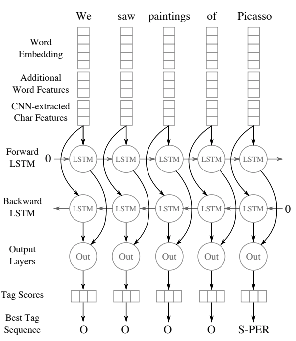

## Goal

- This repo contains an MXNet implementation of this state of the art [entity recognition model](https://www.aclweb.org/anthology/Q16-1026).
- You can find my blog post on the model [here](https://opringle.github.io/2018/02/06/CNNLSTM_entity_recognition.html).

## Running the code

1. Clone this repo
2. Train the model: `$ cd src && python ner.py`