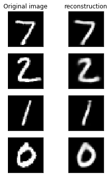
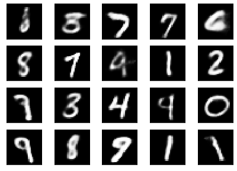

<!--- Licensed to the Apache Software Foundation (ASF) under one -->
<!--- or more contributor license agreements.  See the NOTICE file -->
<!--- distributed with this work for additional information -->
<!--- regarding copyright ownership.  The ASF licenses this file -->
<!--- to you under the Apache License, Version 2.0 (the -->
<!--- "License"); you may not use this file except in compliance -->
<!--- with the License.  You may obtain a copy of the License at -->

<!---   http://www.apache.org/licenses/LICENSE-2.0 -->

<!--- Unless required by applicable law or agreed to in writing, -->
<!--- software distributed under the License is distributed on an -->
<!--- "AS IS" BASIS, WITHOUT WARRANTIES OR CONDITIONS OF ANY -->
<!--- KIND, either express or implied.  See the License for the -->
<!--- specific language governing permissions and limitations -->
<!--- under the License. -->


# VAE with Gluon.probability 

In this example, we will demonstrate how you can implement a Variational Auto-encoder(VAE) with Gluon.probability and MXNet's latest NumPy API.


```{.python .input}
import numpy as np
import mxnet as mx
from mxnet import autograd, gluon, np, npx
from mxnet.gluon import nn
import mxnet.gluon.probability as mgp
import matplotlib.pyplot as plt

# Switch numpy-compatible semantics on.
npx.set_np()

# Set context for model context, here we choose to use GPU. 
model_ctx = mx.gpu(0)
```

## Dataset

We will use MNIST here for simplicity purpose.


```{.python .input}
def load_data(batch_size):
    mnist_train = gluon.data.vision.MNIST(train=True)
    mnist_test = gluon.data.vision.MNIST(train=False)
    num_worker = 4
    transformer = gluon.data.vision.transforms.ToTensor()
    return (gluon.data.DataLoader(mnist_train.transform_first(transformer),
                                batch_size, shuffle=True,
                                num_workers=num_worker),
          gluon.data.DataLoader(mnist_test.transform_first(transformer),
                                batch_size, shuffle=False,
                                num_workers=num_worker))
                                 
```

## Model definition


```{.python .input}
class VAE(gluon.HybridBlock):
    def __init__(self, n_hidden=256, n_latent=2, n_layers=1, n_output=784, act_type='relu', **kwargs):
        r"""
        n_hidden : number of hidden units in each layer
        n_latent : dimension of the latent space
        n_layers : number of layers in the encoder and decoder network
        n_output : dimension of the observed data
        """
        self.soft_zero = 1e-10
        self.n_latent = n_latent
        self.output = None
        self.mu = None
        super(VAE, self).__init__(**kwargs)
        self.encoder = nn.HybridSequential()
        for _ in range(n_layers):
            self.encoder.add(nn.Dense(n_hidden, activation=act_type))
        self.encoder.add(nn.Dense(n_latent*2, activation=None))
        self.decoder = nn.HybridSequential()
        for _ in range(n_layers):
            self.decoder.add(nn.Dense(n_hidden, activation=act_type))
        self.decoder.add(nn.Dense(n_output, activation='sigmoid'))
        
    def encode(self, x):
        r"""
        Given a batch of x,
        return the encoder's output
        """
        # [loc_1, ..., loc_n, log(scale_1), ..., log(scale_n)]
        h = self.encoder(x)

        # Extract loc and log_scale from the encoder output.
        loc_scale = np.split(h, 2, 1)
        loc = loc_scale[0]
        log_scale = loc_scale[1]

        # Convert log_scale back to scale.
        scale = np.exp(log_scale)

        # Return a Normal object.
        return mgp.Normal(loc, scale)
    
    def decode(self, z):
        r"""
        Given a batch of samples from z,
        return the decoder's output
        """
        return self.decoder(z)

    def forward(self, x):
        r"""
        Given a batch of data x,
        return the negative of Evidence Lower-bound,
        i.e. an objective to minimize.
        """
        # prior p(z)
        pz = mgp.Normal(0, 1)
        
        # posterior q(z|x)
        qz_x = self.encode(x) 
        
        # Sampling operation qz_x.sample() is automatically reparameterized.
        z = qz_x.sample() 

        # Reconstruction result
        y = self.decode(z) 
        
        # Gluon.probability can help you calculate the analytical kl-divergence
        # between two distribution objects.
        KL = mgp.kl_divergence(qz_x, pz).sum(1)
        
        # We assume p(x|z) ~ Bernoulli, therefore we compute the reconstruction
        # loss with binary cross entropy.
        logloss = np.sum(x * np.log(y + self.soft_zero) + (1 - x)
                         * np.log(1 - y + self.soft_zero), axis=1)
        loss = -logloss + KL
        return loss
```

## Training


```{.python .input}
def train(net, n_epoch, print_period, train_iter, test_iter):
    net.initialize(mx.init.Xavier(), ctx=model_ctx)
    net.hybridize()
    trainer = gluon.Trainer(net.collect_params(), 'adam',
                          {'learning_rate': .001})
    training_loss = []
    validation_loss = []
    for epoch in range(n_epoch):
        epoch_loss = 0
        epoch_val_loss = 0

        n_batch_train = 0
        for batch in train_iter:
            n_batch_train += 1
            data = batch[0].as_in_context(model_ctx).reshape(-1, 28 * 28)
            with autograd.record():
                loss = net(data)
            loss.backward()
            trainer.step(data.shape[0])
            epoch_loss += np.mean(loss)

        n_batch_val = 0
        for batch in test_iter:
            n_batch_val += 1
            data = batch[0].as_in_context(model_ctx).reshape(-1, 28 * 28)
            loss = net(data)
            epoch_val_loss += np.mean(loss)

        epoch_loss /= n_batch_train
        epoch_val_loss /= n_batch_val

        training_loss.append(epoch_loss)
        validation_loss.append(epoch_val_loss)

        if epoch % max(print_period, 1) == 0:
            print('Epoch{}, Training loss {:.2f}, Validation loss {:.2f}'.format(
              epoch, float(epoch_loss), float(epoch_val_loss)))
```


```{.python .input}
n_hidden = 128
n_latent = 40
n_layers = 3
n_output = 784
batch_size = 128
model_prefix = 'vae_gluon_{}d{}l{}h.params'.format(
  n_latent, n_layers, n_hidden)
net = VAE(n_hidden=n_hidden, n_latent=n_latent, n_layers=n_layers,
        n_output=n_output)
net.hybridize()
n_epoch = 50
print_period = n_epoch // 10
train_set, test_set = load_data(batch_size)
train(net, n_epoch, print_period, train_set, test_set)
```


## Reconstruction visualiztion

To verify the effictiveness of our model, we first take a look at how well our model can reconstruct the data.


```{.python .input}
# Grab a batch from the test set
qz_x = None
for batch in test_set:
    data = batch[0].as_in_context(model_ctx).reshape(-1, 28 * 28)
    qz_x = net.encode(data)
    break
```


```{.python .input}
num_samples = 4
fig, axes = plt.subplots(nrows=num_samples, ncols=2, figsize=(4, 6), subplot_kw={'xticks': [], 'yticks': []})
axes[0, 0].set_title('Original image')
axes[0, 1].set_title('reconstruction')
for i in range(num_samples):
    axes[i, 0].imshow(data[i].squeeze().reshape(28, 28).asnumpy(), cmap='gray')
    axes[i, 1].imshow(net.decode(qz_x.sample())[i].reshape(28, 28).asnumpy(), cmap='gray')
```





## Sample generation

One of the most important difference between Variational Auto-encoder and Auto-encoder is VAE's capabilities of generating new samples.

To achieve that, one simply needs to feed a random sample from $p(z) \sim \mathcal{N}(0,1)$ to the decoder network.


```{.python .input}
def plot_samples(samples, h=5, w=10):
    fig, axes = plt.subplots(nrows=h,
                             ncols=w,
                             figsize=(int(1.4 * w), int(1.4 * h)),
                             subplot_kw={'xticks': [], 'yticks': []})
    for i, ax in enumerate(axes.flatten()):
        ax.imshow(samples[i], cmap='gray')
```


```{.python .input}
n_samples = 20
noise = np.random.randn(n_samples, n_latent).as_in_context(model_ctx)
dec_output = net.decode(noise).reshape(-1, 28, 28).asnumpy()
plot_samples(dec_output, 4, 5)
```




