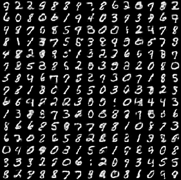

# Restricted Boltzmann machine (RBM)

An example of the binary RBM [1] learning the MNIST data. The RBM is implemented as a custom operator, and a gluon block is also provided. `binary_rbm.py` contains the implementation of the RBM. `binary_rbm_module.py` and `binary_rbm_gluon.py` train the MNIST data using the module interface and the gluon interface respectively. The MNIST data is downloaded automatically.

The progress of the learning is monitored by estimating the log-likelihood using the annealed importance sampling [2,3]. The learning with the default hyperparameters takes about 25 minutes on GTX 1080Ti and the resulting log-likelihood is around -70 for both testing and training datasets.

Here are some samples generated by the RBM with the default hyperparameters. The samples (right) are obtained by 3000 steps of Gibbs sampling starting from randomly chosen real images (left).

<p style="text-align:center"></p>

Usage:

```
python binary_rbm_gluon.py --help
usage: binary_rbm_gluon.py [-h] [--num-hidden NUM_HIDDEN] [--k K]
                           [--batch-size BATCH_SIZE] [--num-epoch NUM_EPOCH]
                           [--learning-rate LEARNING_RATE]
                           [--momentum MOMENTUM]
                           [--ais-batch-size AIS_BATCH_SIZE]
                           [--ais-num-batch AIS_NUM_BATCH]
                           [--ais-intermediate-steps AIS_INTERMEDIATE_STEPS]
                           [--ais-burn-in-steps AIS_BURN_IN_STEPS] [--cuda]
                           [--no-cuda] [--device-id DEVICE_ID]
                           [--data-loader-num-worker DATA_LOADER_NUM_WORKER]

Restricted Boltzmann machine learning MNIST

optional arguments:
  -h, --help            show this help message and exit
  --num-hidden NUM_HIDDEN
                        number of hidden units
  --k K                 number of Gibbs sampling steps used in the PCD
                        algorithm
  --batch-size BATCH_SIZE
                        batch size
  --num-epoch NUM_EPOCH
                        number of epochs
  --learning-rate LEARNING_RATE
                        learning rate for stochastic gradient descent
  --momentum MOMENTUM   momentum for the stochastic gradient descent
  --ais-batch-size AIS_BATCH_SIZE
                        batch size for AIS to estimate the log-likelihood
  --ais-num-batch AIS_NUM_BATCH
                        number of batches for AIS to estimate the log-
                        likelihood
  --ais-intermediate-steps AIS_INTERMEDIATE_STEPS
                        number of intermediate distributions for AIS to
                        estimate the log-likelihood
  --ais-burn-in-steps AIS_BURN_IN_STEPS
                        number of burn in steps for each intermediate
                        distributions of AIS to estimate the log-likelihood
  --cuda                train on GPU with CUDA
  --no-cuda             train on CPU
  --device-id DEVICE_ID
                        GPU device id
  --data-loader-num-worker DATA_LOADER_NUM_WORKER
                        number of multithreading workers for the data loader
```
Default:
```
Namespace(ais_batch_size=100, ais_burn_in_steps=10, ais_intermediate_steps=10, ais_num_batch=10, batch_size=80, cuda=True, data_loader_num_worker=4, device_id=0, k=30, learning_rate=0.1, momentum=0.3, num_epoch=130, num_hidden=500)
```
[1] G E Hinton &amp; R R Salakhutdinov, Reducing the Dimensionality of Data with Neural Networks Science **313**, 5786 (2006)<br/>
[2] R M Neal, Annealed importance sampling. Stat Comput **11** 2 (2001)<br/>
[3] R Salakhutdinov &amp; I Murray, On the quantitative analysis of deep belief networks. In Proc. ICML '08 **25** (2008)