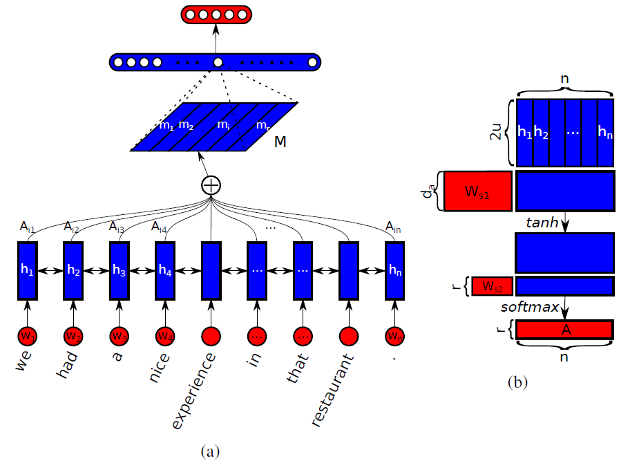

## Implementation of Structured-Self-Attentive-Sentence-Embedding

This is an implementation of the paper [A Structured Self-Attentive Sentence Embedding](https://arxiv.org/abs/1703.03130). This program implements most of the details in the paper. Finally, the user reviews the emotional star ratings in the three experiments mentioned in the original paper, and used the same data set: [The reviews of Yelp Data](https://www.kaggle.com/yelp-dataset/yelp-dataset#yelp_academic_dataset_review.json). The model structure is as follows：




## Requirments

1. [Mxnet](https://mxnet.apache.org/)
2. [Gluon NLP](https://gluon-nlp.mxnet.io)
3. [Numpy](http://www.numpy.org/)
4. [Scikit-Learn](http://scikit-learn.org/stable/)
5. [Python3](https://www.python.org) 

## Implemented

1. **Attention mechanism proposed in the original paper.**
   $$
   A = softmax(W_{s2}tanh(W_{s1}H^T))
   $$

2. **Punishment constraints to ensure diversity of attention.**
   $$
   P = ||(AA^T-I)||_F^2
   $$

3. **Parameter pruning proposed in the appendix of the paper.**

   

4. **Gradient clip and learning rate decay.**

5. **SoftmaxCrossEntropy with category weights**

## For sentiment classification

1. **Training parameter description**

   ```python
   parser.add_argument('--emsize', type=int, default=300,
                           help='size of word embeddings')
       parser.add_argument('--nhid', type=int, default=300,
                           help='number of hidden units per layer')
       parser.add_argument('--nlayers', type=int, default=1,
                           help='number of layers in BiLSTM')
       parser.add_argument('--attention-unit', type=int, default=350,
                           help='number of attention unit')
       parser.add_argument('--attention-hops', type=int, default=1,
                           help='number of attention hops, for multi-hop attention model')
       parser.add_argument('--drop-prob', type=float, default=0.5,
                           help='dropout applied to layers (0 = no dropout)')
       parser.add_argument('--clip', type=float, default=0.5,
                           help='clip to prevent the too large grad in LSTM')
       parser.add_argument('--nfc', type=int, default=512,
                           help='hidden (fully connected) layer size for classifier MLP')
       parser.add_argument('--lr', type=float, default=.001,
                           help='initial learning rate')
       parser.add_argument('--epochs', type=int, default=10,
                           help='upper epoch limit')
       parser.add_argument('--loss-name', type=str, default='sce', help='loss function name')
       parser.add_argument('--seed', type=int, default=2018,
                           help='random seed')
   
       parser.add_argument('--pool-way', type=str, default='flatten', help='pool att output way')
       parser.add_argument('--prune-p', type=int, default=None, help='prune p size')
       parser.add_argument('--prune-q', type=int, default=None, help='prune q size')
   
       parser.add_argument('--batch-size', type=int, default=64,
                           help='batch size for training')
       parser.add_argument('--class-number', type=int, default=5,
                           help='number of classes')
       parser.add_argument('--optimizer', type=str, default='Adam',
                           help='type of optimizer')
       parser.add_argument('--penalization-coeff', type=float, default=0.1,
                           help='the penalization coefficient')
   
       parser.add_argument('--save', type=str, default='../models', help='path to save the final model')
       parser.add_argument('--wv-name', type=str, choices={'glove', 'w2v', 'fasttext', 'random'},
                           default='random', help='word embedding way')
       parser.add_argument('--data-json-path', type=str, default='../data/sub_review_labels.json', help='raw data path')
       parser.add_argument('--formated-data-path', type=str,
                           default='../data/formated_data.pkl', help='formated data path')
   ```

2. **Training details**

   The original paper uses 500K data as the training set, 2000 data as the validation set, and 2000 as the test set. Due to personal machine restrictions, 200 K is randomly selected as the training set and 2000 data is used as the validation set in the case of ensuring the data distribution and the original data. The weight of the WeightedSoftmaxCrossEntropy is set according to the proportion of the data category. If the data is different and needs to be used To use this loss function, you need to modify the value of the set class_weight yourself.

   Training usage (parameters can be customized):  

   ```python
   python train_model.py --nlayers 1 --epochs 5 --attention-hops 2 --loss-name sce
   ```

## Reference

1. **[A Structured Self-Attentive Sentence Embedding](https://arxiv.org/abs/1703.03130)** 

2. **[The reviews of Yelp Data](https://www.kaggle.com/yelp-dataset/yelp-dataset#yelp_academic_dataset_review.json)**
