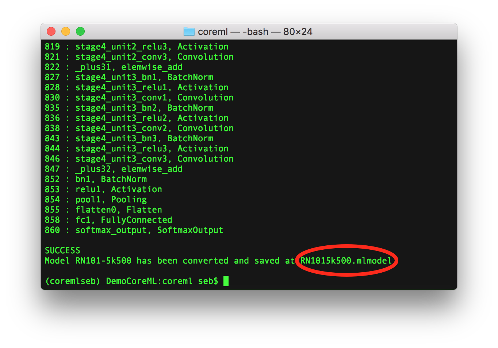
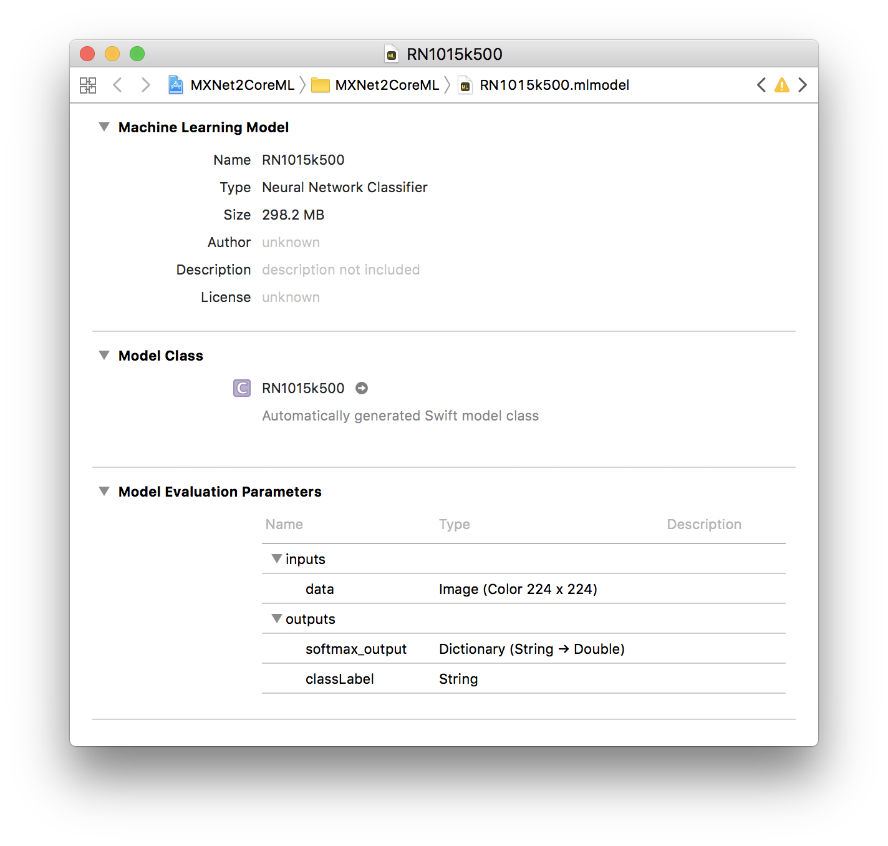
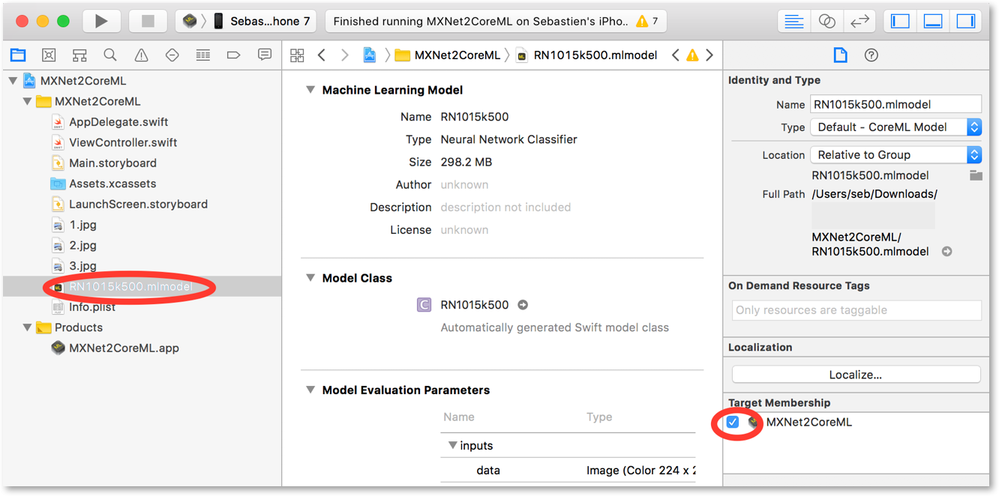
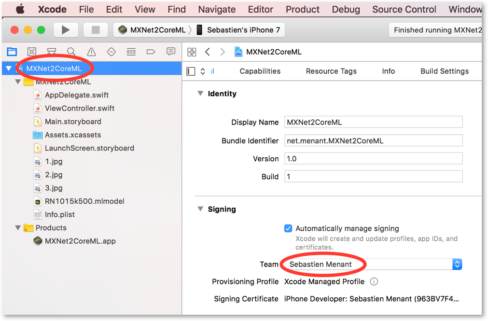
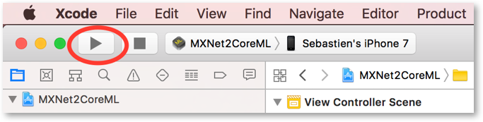
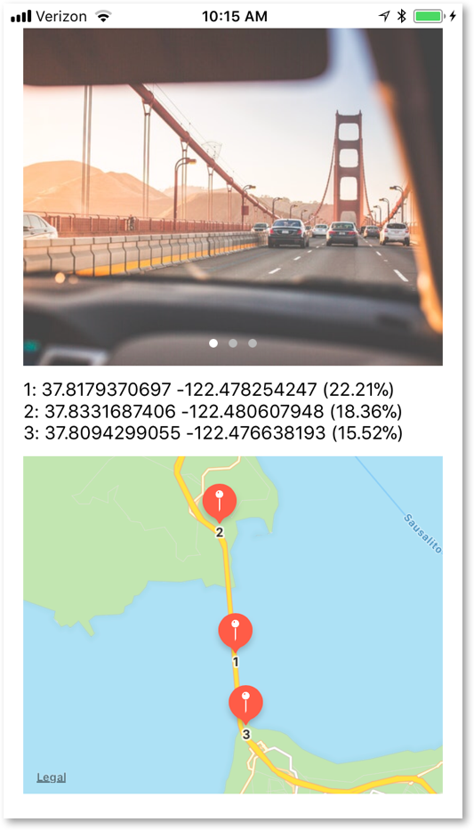
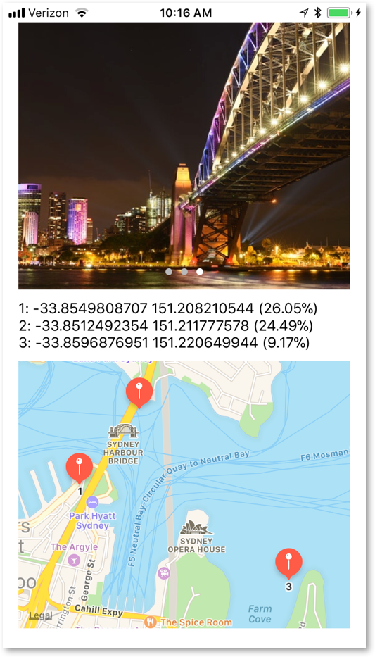

# Bring Machine Learning to iOS apps using Apache MXNet and Apple Core ML

*Note that at the time of writing Xcode 9, iOS 11, and Core ML are still in beta and you need an [Apple Developer Program](https://developer.apple.com/programs/) account to download Xcode and iOS. However, after they are all released publicly later this year, you can use the App Store on your Mac and Software Update on your iOS device to obtain them.*

## Introduction

With the release of [Core
ML](https://developer.apple.com/machine-learning/) by Apple at [WWDC
2017](https://developer.apple.com/videos/play/wwdc2017/703/), iOS,
macOS, watchOS and tvOS developers can now easily integrate a machine
learning model into their app. This enables developers to bring
intelligent new features to users with just a few lines of code. Core ML
makes machine learning more accessible to mobile developers. It also
enables rapid prototyping and the use of different sensors (like the
camera, GPS, etc.) to create more powerful apps than ever.

Members of the Apache MXNet community, including contributors from Apple
and Amazon Web Services (AWS), have collaborated to produce a tool that
converts machine learning models built using Apache MXNet to Apple’s
Core ML format. This tool makes it easy for developers to build apps
powered by machine learning for Apple devices. With this conversion
tool, you now have a fast pipeline for your deep-learning-enabled
applications. You can move from scalable and efficient distributed model
training in the AWS Cloud using MXNet to fast run time inference on
Apple devices.

To support the release of the converter tool we decided to build a cool
iOS app. We were inspired by a previous AWS AI Blog post, [Estimating
the Location of Images Using MXNet and Multimedia Commons Dataset on AWS
EC2](https://aws.amazon.com/blogs/ai/estimating-the-location-of-images-using-mxnet-and-multimedia-commons-dataset-on-aws-ec2/),
that showcases the LocationNet model to predict the location where
pictures were taken.

In this document, we explain how to set up an environment to convert
Apache MXNet models into Apple’s Core ML, convert an existing model, and
then import it into a sample iOS app written in Swift. The iOS app feeds
a picture to the model, which predicts the location where that image was
taken, and shows it on an interactive map. For performance, we recommend
that you run the app on a physical iOS device (e.g., an iPhone)
installed with iOS 11 beta, but you can also try it on the Simulator
that comes with the Xcode 9.0 beta.

## Installation of Apache MXNet and the converter tool
*The tool was installed and tested on the macOS High Sierra 10.13 beta 8. However, as long as you don’t run inferences on a Core ML model on your Mac, you can run the converter on macOS El Capitan (10.11) and later.*

To run the converter tool, you need to have Python 2.7 installed.

Run the following command to install the MXNet framework, and the
[mxnet-to-coreml](https://pypi.python.org/pypi/mxnet-to-coreml) tool:

```sh
$ pip install mxnet-to-coreml
```

## Conversion of the MXNet model

The LocationNet model was trained using MXNet on a single p2.16xlarge
Amazon EC2 instance with geo-tagged images from the [AWS Multimedia
Commons
dataset](https://aws.amazon.com/public-datasets/multimedia-commons/). It
is shared publicly on the [MXNet Model
Zoo](https://mxnet.incubator.apache.org/model_zoo/).

As with any MXNet model, LocationNet has two parts:

-   A JSON file containing the model definition

-   A binary file containing the parameters

Go ahead and download the [.json model
definition](https://s3.amazonaws.com/mmcommons-tutorial/models/RN101-5k500-symbol.json)
and the [.params model
parameters](https://s3.amazonaws.com/mmcommons-tutorial/models/RN101-5k500-0012.params)
files stored on Amazon S3.

In addition, you will need to download the classes file
[grids.txt](https://github.com/multimedia-berkeley/tutorials) from the
GitHub repository, which contains the geographic cells used for training
the model. It was created with the training data using [Google's S2
Geometry
Library](https://code.google.com/archive/p/s2-geometry-library/). Each
line in this text file is in the form of S2 Cell Token, Latitude,
Longitude (e.g., 8644b594 30.2835162512 -97.7271641272). The Swift code
in the iOS app will drop the S2 Cell Token information and only use the
coordinates.

As explained on the GitHub repository for the [conversion
tool](https://github.com/apache/incubator-mxnet/tree/master/tools/coreml),
we will now convert the model.

After you have everything downloaded in the same directory, run this
command:

```sh
$ mxnet\_coreml\_converter.py --model-prefix='RN101-5k500' --epoch=12 --input-shape='{"data":"3,224,224"}' --mode=classifier --pre-processing-arguments='{"image\_input\_names":"data"}' --class-labels grids.txt --output-file="RN1015k500.mlmodel"
```

Internally, the model is first loaded by MXNet recreating the entire
symbolic graph in memory. The converter walks through this symbolic
graph converting each operator into its Core ML equivalent. Some of the
supplied arguments to the converter are used by MXNet to generate the
graph, while others are used by Core ML either to pre-process the input
(before passing it to the neural network) or to process the output of
the neural network in a particular way.

You should see the converter tool processing the multiple layers of the
model, and then confirm **SUCCESS** with the name of the file generated.
You will import the resulting file **RN1015k500.mlmodel** into your
Xcode project in later stages.



With Xcode installed, if you double-click this model file, you can get
more information about it, such as its size, name, and parameters, which
would usually be used within your Swift code:



## Download and configure the code for the iOS app

*The sample iOS app was written in Swift using Xcode 9 beta 6 on a Mac running macOS Sierra 10.12.6.*
*The app was tested on an iPhone 7 running iOS 11 beta 8.*

We decided to use Apple’s new [Vision
framework](https://developer.apple.com/documentation/vision) to
facilitate the use of Core ML with images because it automatically
converts an image to the format and size that the Core ML model expects.
Vision provides solutions to computer vision challenges through a
consistent interface, and its features include face tracking, face
detection, landmarks, text detection, rectangle detection, barcode
detection, object tracking, and image registration.

We used the following resources to get started:

-   [Integrating a Core ML Model into Your
    App](https://developer.apple.com/documentation/coreml/integrating_a_core_ml_model_into_your_app)

-   Apple Vision framework code samples from Matthijs Hollemans’
    [CoreMLHelpers](https://github.com/hollance/CoreMLHelpers)

Go ahead and download the iOS app source code from the MXNet project
[GitHub
repository](https://github.com/menant/incubator-mxnet/tree/master/tools/coreml/iOS_sample_app).

Open **MXNet2CoreML.xcodeproj** with Xcode.

Drag and drop the file **RN1015k500.mlmodel** that you generated earlier
into your Xcode project navigator as shown on the right in the following
picture, and make sure to tick the **Target Membership** checkbox for
the current project.

In case you did not install the converter tool and you just want to try
the iOS app, split files to create the Core ML model
**RN1015k500.mlmodel** can be found in this [GitHub
repository](https://github.com/menant/RN1015k500). Follow the
instructions provided on the same page then drag and drop the resulting
file into the Xcode project navigator.



## Run the app, see some magic

As stated previously, we recommend that you test the app on a physical
device running iOS 11 (still in beta at the time of writing).

You can also run it in the Xcode Simulator but the performance and
animations will not be great, especially if you pan or zoom in the map
area.

Remember to sign the app with your **Team** account if you decide to run
it on a physical iOS device, as shown in the following screenshot.

As we said in our preliminary notes, you will need an Apple Developer
account for this to work.



Press **play** to build your app and run it on the iPhone.



The app will install on the iPhone and you should see the following
screen.

It contains 3 sections:

-   The **top section** displays a picture taken somewhere in the world.
    Swipe left or right on the picture to display one of the 3 built-in
    images. It’s relatively easy for the human eye to recognize these
    locations, but it is impressive to see that the model predicts
    really accurate locations when there is no GPS data embedded in
    these images!

-   The **middle section** displays 3 real-time predictions with “1”
    being the most probable location with a higher percentage of
    probability. We purposely decided to only display the top 3
    predictions out of the hundreds of predictions that the model
    produces.

-   The **bottom section** displays an interactive map with pins for
    each of the 3 locations that were predicted by the model. You can
    zoom and pan at your leisure to explore the area where the pins are
    located.

Screenshot 1:



Screenshot 2:



## What’s next?

If you want to try the app with your own picture saved on your computer,
just rename your picture **1.jpg**, delete the existing file from the
Xcode **project navigator,** and drag and drop it. We discussed how to
do this in the section on the Core ML model.

You could also develop the sample app a bit further by implementing a
camera function that allows you to take pictures within the app or load
from the camera roll, and perform real-time location prediction on
images you have already taken or would take on the spot.

We are excited to discover the different ways this sample app will
inspire you. If you have questions, comments or suggestions, please post
them in the **Comments** section in the matching blog post on the [AWS
AI Blog](https://aws.amazon.com/blogs/ai/).

Have fun!
